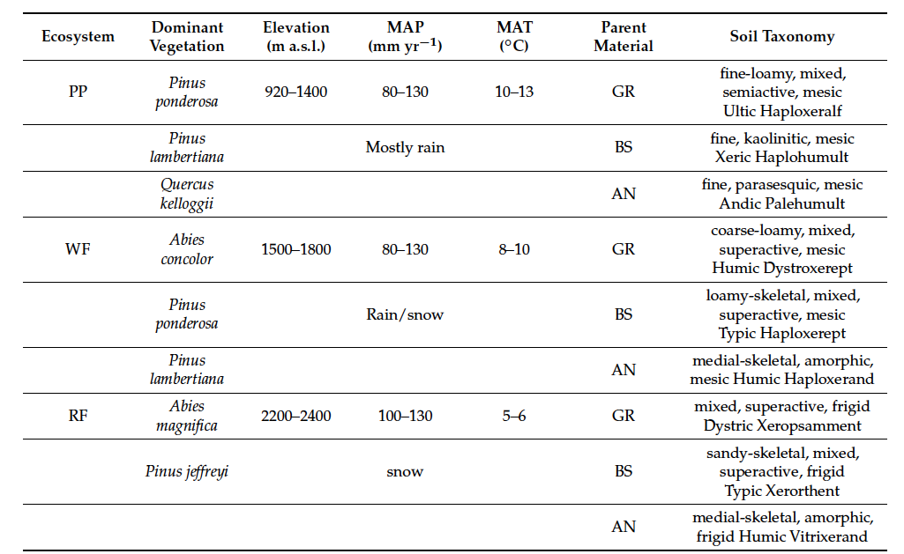

```{r global_options, include = FALSE}
knitr::opts_chunk$set(echo = FALSE, warning = FALSE, message = FALSE,
                      fig.align = 'center', dev = c('cairo_pdf', 'png'),
                      crop = NULL)
options(scipen = 5)
```

```{r setup, include = FALSE}
library(ggplot2)
library(dplyr)
library(tidyr)
library(SoilR)
library(readxl)
library(ISRaD)
library(emmeans)
library(gt)
library(GSIF)
library(aqp)
library(cowplot)
library(papaja)
library(kableExtra)
library(grid)
library(gridExtra)
```

```{r col-pals}
# color palettes for ECO & PM
warm <- "#BF812D"
cool <- "#80CDC1"
cold <- "#01665E"
granite <- "#9daba9"
andesite <- "#382dbf"
basalt <- "#bf382d"
```

```{r atm-14c}
load("atm.14c.RData")
atm.14c <- atm.14c %>% rename(Year = year) %>% mutate(Type = "atmosphere")
slope.atm14c.01.19 <- round(summary(lm(d14c ~ Year, atm.14c))$coef[2,1],2)
```

```{r load-min}
load("ras18.sp.df.RData")
```

```{r ingest-fxs, include=FALSE}
source("./utilities/jena_ams_ingest.R")
source("./utilities/jena_elm_ingest.R")
```

```{r load-C-data}
# 2001
sra.01.blkC <- read_excel("../data/external/sra_ras_sum/sierra_data_summary_2020.xlsx", sheet = "2001_bulk_data") %>% type.convert(., as.is = TRUE) %>% data.frame

# 2009
sra.09.blkC <- read_excel("../data/external/sra_ras_sum/sierra_data_summary_2020.xlsx", sheet = "2009_bulk_data") %>% type.convert(., as.is = TRUE) %>% data.frame

# 2019
elm_results_dir <- list.files("../data/raw", pattern = "elm_jena_results", full.names = TRUE)
elm_results_ls <- suppressMessages(lapply(seq_along(elm_results_dir), function(i) {
  read_jena_elm_results(elm_results_dir[i], verbose = FALSE)
}))
names(elm_results_ls) <- list.files("../data/raw", pattern = "elm_jena_results")
```

```{r define-C-spline-fx}
# depth spline for C percent, where d = vector of layer bottom depths
Cspline.fx <- function(df, var.name, d = c(10, 20, 30), show.progress = TRUE) {
  bind_rows(lapply(split(df, df$pro_name), function(x) {
    depths(x) <- pro_name ~ lyr_top + lyr_bot
    x.mps <- mpspline(x, var.name = var.name, d = t(c(0, d)), 
                      show.progress = show.progress)
    x.std <- t(x.mps$var.std)
    df <- data.frame(x.std, row.names(x.std))
    names(df) <- c(var.name, "depth")
    df$depth <- gsub(" [^ ]*$", "", df$depth)
    return(df[1:length(d), ])
  }), .id = "pro_name")
}
```

```{r summarize-C-data, include=FALSE}
## 2001
# remove oak sites and sites w/o C data
sra.01.blkC <- sra.01.blkC[c(which(grepl("AN", sra.01.blkC$ID)), which(grepl("BS", sra.01.blkC$ID)), which(grepl("GR", sra.01.blkC$ID))), ]
sra.01.blkC <- sra.01.blkC[which(!is.na(sra.01.blkC$C.)), ]

# convert lyr_top to numeric and add pro_name col
sra.01.blkC$lyr_top <- as.numeric(sra.01.blkC$lyr_top)

# Need to account for different depth increments among profiles: depth spline C.
# split by profile and spline
sra.01.blkC$pro_name <- paste0(sra.01.blkC$PMeco, sra.01.blkC$pro_rep)
sra.01.blkC.sp <- Cspline.fx(sra.01.blkC, var.name = "C.")
sra.01.blkC.sp.reps <- sra.01.blkC.sp
sra.01.blkC.sp.reps$PMeco <- substr(sra.01.blkC.sp.reps$pro_name, 1, 4)
sra.01.blkC.sp.reps$year <- 2001
# summarize
sra.01.blkC.sum <- data.frame(
  sra.01.blkC.sp %>%
    mutate(PMeco = substr(pro_name, 1, 4)) %>%
    group_by(PMeco, depth) %>%
    summarize(across(c_pct, .fns = c(mean = mean, sd = sd)))
)

## 2009
# spline
sra.09.blkC.sp <- Cspline.fx(
  sra.09.blkC %>% 
    rename(lyr_bot = bottom.mineral, lyr_top = top.mineral), 
  var.name = "C_pct")
sra.09.blkC.sp.reps <- sra.09.blkC.sp
sra.09.blkC.sp.reps$PMeco <- substr(sra.09.blkC.sp.reps$pro_name, 1, 4)
sra.09.blkC.sp.reps$year <- 2009

# summarize
sra.09.blkC.sum <- data.frame(
  sra.09.blkC.sp %>%
    mutate(PMeco = substr(pro_name, 1, 4)) %>%
    group_by(PMeco, depth) %>%
    summarize(across(c_pct, .fns = c(mean = mean, sd = sd)))
)

## 2019
# reps
sra.19.blkC.reps <- bind_rows(unlist(elm_results_ls, recursive = FALSE)) %>%
  mutate(PMeco = sapply(strsplit(ID, "_"), "[", 2),
         depth = sapply(strsplit(ID, "_"), "[", 4),
         year = 2019)
sra.19.blkC.reps.30 <- bind_rows(
  lapply(split(sra.19.blkC.reps, sra.19.blkC.reps$PMeco), function(df) {
    df$lyr_bot <- as.numeric(unlist(lapply(strsplit(df$depth, "-"), "[[", 2)))
    df <- df[df$lyr_bot < 31, ]
    df$rep <- rep(seq(1, 3), each = 3)
    df$pro_name <- paste(df$PMeco, df$rep, sep = "_")
    names(df)[which(names(df) == "C")] <- "c_pct"
    return(df[ , names(df) %in% names(sra.09.blkC.sp.reps)])
  }))

# summary
sra.19.blkC.sum <- data.frame(
  bind_rows(unlist(elm_results_ls, recursive = FALSE)) %>%
  mutate(PMeco = sapply(strsplit(ID, "_"), "[", 2),
         depth = sapply(strsplit(ID, "_"), "[", 4)) %>%
  group_by(PMeco, depth) %>%
  summarize(across(c(C, N), .fns = c(mean = mean, sd = sd))) %>%
  rename(c_pct_mean = C_mean,
         c_pct_sd = C_sd))
# extract < 31 cm
sra.19.blkC.sum.30 <- bind_rows(
  lapply(split(sra.19.blkC.sum, sra.19.blkC.sum$PMeco), function(df) df[1:3, ]))
```

```{r bulk-data-wrangling}
# load data
load("sra.19.01.09.RData")
load("sra.19.01.rep.ls.RData")
load("sra.2019.ls.RData")
load("sra.2001.ls.RData")

## change over time
# merge '01 and '19 data
sra.19.01.d <- merge(sra.19.01.09[sra.19.01.09$Year == 2001 & sra.19.01.09$lyr_bot, ],
                     sra.19.01.09[sra.19.01.09$Year == 2019 & sra.19.01.09$lyr_bot < 31, ],
                     by = c("PM", "ECO", "PMeco", "lyr_top", "lyr_bot"),
                     suffixes = c("_01", "_19")) 
sra.19.01.d$dd14c_01_19 <- sra.19.01.d$d14c_01 - sra.19.01.d$d14c_19
sra.19.01.d$sd14c_01_19 <- sqrt(sra.19.01.d$d14c_sd_01^2/3 + sra.19.01.d$d14c_sd_19^2/3)

## summarize change '01-'19
# PM
sra.19.01.dsum.PM <-
  sra.19.01.d %>%
  filter(lyr_bot < 31) %>%
  group_by(PM, lyr_bot) %>%
  summarize(across(dd14c_01_19, .fn = list(mean = mean, sd = sd), na.rm = TRUE))
# ECO
sra.19.01.dsum.ECO <-
  sra.19.01.d %>%
  filter(lyr_bot < 31) %>%
  group_by(ECO, lyr_bot) %>%
  summarize(across(dd14c_01_19, .fn = list(mean = mean, sd = sd), na.rm = TRUE))

## make long data frame of rep data
# 2001 = sra.19.01.rep.ls (splined to '19 depths)
sra.19.01.rep.df <- bind_rows(lapply(sra.19.01.rep.ls, function(PMeco) {
  df <- bind_rows(lapply(PMeco, function(r) {
    fm <- r[!is.na(r)]
    lyr_bot <- seq(10, length(fm) * 10, by = 10)
    return(data.frame(fm = fm, lyr_bot = lyr_bot))
    }), .id = "PMeco_rep")
  df$pro_rep <- substr(df$PMeco_rep, nchar(df$PMeco_rep), nchar(df$PMeco_rep))
  return(df[ , c("fm", "lyr_bot", "pro_rep")])
}), .id = "PMeco")
sra.19.01.rep.df$Year <- 2001
sra.19.01.rep.df$PM <- substr(sra.19.01.rep.df$PMeco, 1, 2)
sra.19.01.rep.df$ECO <- substr(sra.19.01.rep.df$PMeco, 3, 4)
# 2019 = sra.2019.ls
sra.2019.rep.df <- bind_rows(sra.2019.ls, .id = "PMeco")
sra.2019.rep.df <- sra.2019.rep.df[sra.2019.rep.df$lyr_bot < 31, ]

# 2009 (splined to '19 depths)
sra.09.19.df <- sra.19.01.09[sra.19.01.09$Year == "2009", 
                             c("PMeco", "fm", "lyr_bot", "Year", "PM", "ECO")] %>%
  mutate(pro_rep = 1) %>%
  filter(lyr_bot < 31)

# merge
sra.01.09.19.d.df <- rbind(
  sra.2019.rep.df[ , match(names(sra.19.01.rep.df), names(sra.2019.rep.df))],
  sra.09.19.df,
  sra.19.01.rep.df) %>%
  left_join(., ras18.sp.df[ , c("Al_ox", "Al_py", "Fe_dc", "Fe_ox", "lyr_bot", "PM", "ECO")], 
  by = c("lyr_bot", "PM", "ECO")) %>%
  mutate(PM = factor(recode(PM, `AN` = "andesite", `BS` = "basalt", `GR` = "granite")),
         ECO = factor(recode(ECO, `pp` = "warm", `wf` = "cool", `rf` = "cold"),
                      levels = c("warm", "cool", "cold")),
         year = as.numeric(Year) - 2000,
         Year = as.numeric(Year))
sra.01.09.19.d.df$d14c <- convert_fm_d14c(fm = sra.01.09.19.d.df$fm,
                                          obs_date_y = sra.01.09.19.d.df$Year, verbose = FALSE)

# by depth
sra.01.09.19.d.10df <- sra.01.09.19.d.df[sra.01.09.19.d.df$lyr_bot == 10, ]
sra.01.09.19.d.20df <- sra.01.09.19.d.df[sra.01.09.19.d.df$lyr_bot == 20, ]
sra.01.09.19.d.30df <- sra.01.09.19.d.df[sra.01.09.19.d.df$lyr_bot == 30, ]

# extract GRrf data for referencing extreme values
sra.01.blk.GRrf.df  <- sra.19.01.d %>% filter(PMeco == "GRrf")
```

```{r resp-data-wrangling}
# load data
load("sra.19.01.inc.df.RData")
load("sra.2019.inc.df.RData")
load("sra.2001.inc.df2.RData")
load("sra.2019.inc.df2.RData")
load("sra.2001.inc.ls.RData")

# bind raw 2001 inc data to df for referencing extreme values
sra.01.inc.raw.df <- bind_rows(sra.2001.inc.ls, .id = "PMeco")
sra.01.inc.GRrf.df <- sra.01.inc.raw.df %>% filter(PMeco == "GRrf")

# make df of '19 inc data from GRrf for referencing extreme values
sra.19.inc.GRrf.df <- sra.2019.inc.df2 %>% filter(PMeco == "GRrf")

# rbind '01 and '19 data
sra.01.19.inc.d.df <- rbind(cbind(sra.2001.inc.df2, 
                                  rep = rep(c("a", "b"), each = 27),
                                  Year = 2001),
                            sra.2019.inc.df2[ , c("PM", "ECO", "rep", "lyr_bot", "Year", "d14c")]) %>%
  left_join(., ras18.sp.df[ , c("Al_ox", "Al_py", "Fe_dc", "Fe_ox", "lyr_bot", "PM", "ECO")], 
  by = c("lyr_bot", "PM", "ECO")) %>%
  mutate(PM = factor(recode(PM, `AN` = "andesite", `BS` = "basalt", `GR` = "granite")),
         ECO = factor(recode(ECO, `pp` = "warm", `wf` = "cool", `rf` = "cold"),
                      levels = c("warm", "cool", "cold")),
         year = Year - 2000)

## change over time
# merge '01 and '19 data
sd.inc.fx <- function(df) {
  apply(df[ , c("d14c_min", "d14c_max")], 1, sd)
}
sra.19.01.inc.d.df <- merge(
  cbind(sra.19.01.inc.df, sd = sd.inc.fx(sra.19.01.inc.df))[ , c("PM", "ECO", "PMeco", "lyr_bot", "d14c", "sd")],
  cbind(sra.2019.inc.df, sd = sd.inc.fx(sra.2019.inc.df))[ , c("PM", "ECO", "PMeco", "lyr_bot", "d14c", "sd")],
  by = c("PM", "ECO", "PMeco", "lyr_bot"),
  suffixes = c("_01", "_19"))
sra.19.01.inc.d.df$dd14c_01_19 <- sra.19.01.inc.d.df$d14c_01 - sra.19.01.inc.d.df$d14c_19
sra.19.01.inc.d.df$sd14c_01_19 <- sqrt(
  sra.19.01.inc.d.df$sd_01^2/2 + sra.19.01.inc.d.df$sd_19^2/2)

## filter outliers
sra.01.19.inc.d.df <- sra.01.19.inc.d.df[-which(sra.01.19.inc.d.df$d14c < -200), ]

# df by depth
sra.01.19.inc.d.10.df <- sra.01.19.inc.d.df[sra.01.19.inc.d.df$lyr_bot == 10, ]
sra.01.19.inc.d.20.df <- sra.01.19.inc.d.df[sra.01.19.inc.d.df$lyr_bot == 20, ]
sra.01.19.inc.d.30.df <- sra.01.19.inc.d.df[sra.01.19.inc.d.df$lyr_bot == 30, ]
```

```{r emmip-plot-fx}
# plot function for timeseries (combines bulk and respired data)
emmip.plot.all.fx <- function(var, split_var, depths, Type) {
  
  # define plot vars
  quo_var <- sym(var)
  brks <- c(2001, 2009, 2019)
  
  # set color scales
  if (var == "PM") {
    cvals <- c("andesite" = andesite, "basalt" = basalt, "granite" = granite)
  } else {
    cvals <- c("warm" = warm, "cool" = cool, "cold" = cold)
  }
  
  # emmip fx
  emmip.df.fx <- function(dat, var, Type) {
    
    # mod list
    mod.ls <- lapply(dat, function(lyr_bot) {
      lm(d14c ~ PM * Year * ECO, lyr_bot)
    })
    
    # set breaks
    if (Type == "respired") {
      brks <- c(2001, 2019)
    }
    
    # emmip fx
    emmip.fx <- function(mod, var) {
      if (var == "PM") {
        emmip(mod, PM ~ Year | ECO, CIs = TRUE, at = list(Year = brks))$data
      } else {
        emmip(mod, ECO ~ Year | PM, CIs = TRUE, at = list(Year = brks))$data
      }
    }
    
    # return emmip ls
    return(lapply(mod.ls, function(mod) {
      emmip.df <- emmip.fx(mod, var)
      emmip.df$Type <- Type
      return(emmip.df)
    }))
  }
  
  # plot fn
  plot.fx <- function(ls, data, Type) {
    
    # run loop
    lapply(seq_along(ls), function(i) {

      # plot
      ggplot(ls[[i]], aes(xvar, yvar)) +
        geom_line(aes(color = !! quo_var, linetype = Type), size = .8, show.legend = FALSE) +
        geom_ribbon(aes(ymin = LCL, ymax = UCL, fill = !! quo_var, linetype = Type), alpha = .1, show.legend = FALSE) +
        geom_point(data = data[[i]],
          aes(Year, d14c, color = !! quo_var, shape = ecoType), size = 1.5, alpha = .8) +
        # atm
        geom_line(data = atm.14c, aes(Year, d14c, linetype = Type), color = "black") +
        scale_linetype_manual(name = NULL, 
                              limits = c("bulk soil", "respired", "atmosphere"),
                              values = c("bulk soil" = 1,
                                         "respired" = 2,
                                         "atmosphere" = 3)) +
        scale_shape_manual(name = NULL,
                           limits = c("warm (bulk soil)", "cool (bulk soil)", "cold (bulk soil)",
                                      "warm (respired)", "cool (respired)", "cold (respired)"),
                           values = c("warm (bulk soil)" = 15, 
                                      "cool (bulk soil)" = 17, 
                                      "cold (bulk soil)" = 16,
                                      "warm (respired)" = 0, 
                                      "cool (respired)" = 2, 
                                      "cold (respired)" = 1)) +  
        scale_color_manual(name = NULL,
                           values = cvals) +
        scale_fill_manual(name = NULL,
                          values = cvals) +
        scale_x_continuous(limits = c(2000, 2020), 
                           breaks = brks, expand = expansion(add = 2)) +
        coord_cartesian(ylim = c(-110, 170)) +
        theme_bw() +
        theme(panel.grid = element_blank(),
              axis.title = element_blank(),
              axis.text.x = element_text(size = 7),
              strip.background = element_blank(),
              strip.text.x = element_blank(),
              plot.margin = unit(rep(0, 4), "cm"),
              legend.position = "none")
    })
  }
  
  # data prep fx
  data.ls.fx <- function(data.df) {
    lapply(split(data.df, data.df$lyr_bot), function(df) {
        df$Type <- Type
        df$ecoType <- paste0(df$ECO, " (", df$Type, ")")
        return(df)
    })[depths]
  }
  
  # extract data by Type
  if (Type == "respired") {
    data.ls <- data.ls.fx(sra.01.19.inc.d.df)
  } else {
    data.ls <- data.ls.fx(sra.01.09.19.d.df)
  }
  
  # run emip
  emip.ls <- emmip.df.fx(data.ls, var, Type)
  
  # list split fx
  split.fx <- function(ls, split_var) {
    lapply(ls, function(df) {
      split(df, df[[split_var]])
    })
  }
  
  # split data and emip lists by split_var
  emip.ls.sp <- split.fx(emip.ls, split_var)
  data.ls.sp <- split.fx(data.ls, split_var)
  
  # plot list
  p.ls <- lapply(seq_along(data.ls.sp), function(j) {
    p <- plot.fx(data = data.ls.sp[[j]], ls = emip.ls.sp[[j]], Type = Type)
    names(p) <- names(data.ls.sp[[j]])
    return(p)
  })
  
  # add names and return p.ls
  names(p.ls) <- names(emip.ls.sp)
  return(p.ls)
}
```

# Key messages:
*	Climate explains more variance in $\Delta$^14^C at the soil surface; parent material explains more variance at depth
*	Interaction of parent material and climate explains more variance in bulk soil and respired $\Delta$^14^C than either factor alone
*	Poorly crystalline mineral content is highly correlated with the difference between bulk soil and respired $\Delta$^14^C


# Introduction
Understanding the response of soil carbon stocks to current and future changes in climate requires insight into both the physical and environmental factors governing soil carbon dynamics. Climate, and in particular temperature, has been found to be the most important variable for explaining the age of soil carbon in topsoil at local to global scales [Frank et al., 2012; Mathieu et al., 2015; Shi et al. 2020]. Yet our current understanding of soil organic matter decomposition underscores the importance of physical mechanisms that can affect the temperature sensitivity of decomposition, such as the interaction between soil organic matter and minerals [Davidson et al., 2000; Davidson and Janssens, 2006; Rasmussen et al., 2006; Lehmann and Kleber, 2015;]. The effect of mineral-organic associations on the temperature sensitivity of soil organic matter has been addressed in several modeling studies [Abramoff et al., 2019; Riley et al., 2016; Ahrens et al., 2015; Woolf and Lehmann, 2019]. These models typically invoke Michaelis Menten kinetics in addition to an Arrhenius-type temperature response in order to account for energy and substrate limitations on decomposition rates for soil organic matter found in association with minerals [Tang and Riley, 2019; Ahrens et al., 2020]. Studies comparing the relative importance of different soil mineral assemblages versus temperature for explaining soil C dynamics over time *in situ*  are scarce, yet are critical in order to test these model-based findings. We designed the current study to quantify the relative importance of climatic versus mineralogical mechanisms of soil organic C persistence, and to provide insight into the relevant time scales associated with these mechanisms.

The relevance of soil minerals for mediating soil organic matter protection has been found to be a function of the specific minerals present, rather than the amount of clay or total mineral surface area [Rasmussen et al. 2018a, "Beyond Clay"]. Soil mineral assemblages are dynamic, developing over time as primary minerals inherited from parent material weather to form reactive, poorly crystalline secondary minerals, which in turn eventually weather to increasing stable crystalline species [Slessarev 2022, others...]. Soils enriched in poorly crystalline minerals, such as Al and Fe oxyhydroxides, are known to be of particular importance for the accumulation and persistence of soil C [Torn 1997, Maseiello 2004]. The amount of these minerals present is directly related to parent material, but is also a function of primary mineral weathering rates [Slesserav et al. 2022]. Due to the strong effect of climate on these rates, different soil mineral assemblages can form from the same parent material under different climatic regimes (Rasmussen et al. 2018b). Conversely, similar mineral assemblages can be found among soils developed on different parent materials given adequate time for weathering and similar vegetation and climate [Graham and O'Geen 2010 "Soil mineralogy trends in California landscapes"]. These differential outcomes demonstrate that climatic and mineralogical controls on soil C cycling are not independent, but interact over the centennial to millenial time scales of soil development. 

The strength and sorptive capacity of soil minerals is dependent on ligand exchange, which is a function of not only surface area and charge, but more specifically the density of accessible hydroxyl groups (Kaiser and Guggenberger, 2003; Rasmussen et al., 2018a “Beyond Clay”; Kleber et al., 2015). Poorly crystalline metal oxides are particularly enriched in hydroxyl groups, and batch sorption/desorption experiments have shown that the mineral-organic interactions between pedogenic oxide rich clays are stronger than those with siloxane-rich phyllosilicate clays (Kahle et al., 2004). Furthermore, the reactive properties of pedogenic oxides can also facilitate lower strength interactions with soil organic matter through multivalent cation bridging (Kleber et al., 2007). The importance of pedogenic oxides for explaining both soil C concentration and bulk soil radiocarbon ($\Delta$^14^C~*bulk*~) is confirmed by the findings of Rasmussen et al. (Soil systems, 2018a) [other citations?], who observed that oxalate extractable iron was the best predictor of both properties. However, the relevance of mineral-organic associations with specific minerals such as poorly crystalline metal oxides or crystalline metal oxides for specific timescales of soil C turnover is poorly studied.

Radiocarbon (^14^C) is a useful tracer for soil C dynamics over time scales ranging from annual to millennial. The use of ^14^C to measure timescales of soil carbon decomposition is reliant on our knowledge of the ratio of ^12^C/^14^C in the atmosphere. Once CO~2~ is fixed into organic matter via photosynthesis, this ratio starts to shift as ^14^C is preferentially lost due to radioactive decay. Changes in the ^12^C/^14^C ratio due to radioactive decay are detectable at the relatively longer timescales of hundreds to thousands of years. However, we can detect changes in ^14^C with nearly annual resolution for the so-called “bomb-C” period, which began with the deployment and atmospheric testing of nuclear weapons in the mid-20^th^ century. This pulse of “bomb-C” led to a doubling of atmospheric ^14^C concentration prior to the ban on above-ground nuclear tests in 1963. The level of ^14^C in the atmosphere returned to pre-bomb levels around 2020, thus archived samples now represent the best opportunity to construct a high-resolution time series of the bomb-C pulse as it moves through different soil organic matter pools.

Soil is an open system, and this has important implications for the interpretation of radiocarbon measurements of soil C. For most soils, the majority of carbon that enters the soil leaves relatively quickly, with only a small fraction persisting (Sierra et al. 2018). Radiocarbon measurements of bulk soil C typically capture the signal from these persistent pools, while more transient pools dominate measurements of C leaving the soil via heterotrophic respiration (Trumbore 2000). Here we define "transient" for C cycling on annual to decadal timescales, while we use "persistent" to refer to C cycling on centennial to millennial timescales. A diagnostic feature of the radiocarbon measurements of $\Delta$^14^C~*bulk*~ and heterotrophically respired CO~2~ ($\Delta$^14^C~*respired*~) is that when these two signals are the same it indicates that all of the C in the soil has an equal probability of being decomposed by microbes and the system is homogenous. However, when $\Delta$^14^C~*bulk*~ and $\Delta$^14^C~*respired*~ are substantially different this indicates the presence of both labile and persistent pools of soil C.

We turned to the western slope of the Sierra Nevada Mountains, USA to compare and contrast the effects of climate and mineral assemblage on soil C dynamics. Drawing on earlier studies in this region, we selected soils similar in age and vegetation along a combined gradient of parent material (granite, andesite, basalt) and climate ( "warm", cool, cold). The climate gradient also represents a weathering gradient, with poorly developed soils at the cold climate sites, intermediately developed soils at the cool climate sites, and highly weathered soils at the warm climate sites. Previous work at these sites confirmed strong differences in mineral assemblages along both the parent material and climate gradients, making these sites an ideal setting for probing the relative influence of climatic and mineralogical factors on soil C dynamics.

We were able to construct a time series of both $\Delta$^14^C~*bulk*~ and $\Delta$^14^C~*respired*~ at these sites by combining data from samples newly collected in 2019 with data from archived samples collected in 2001 and 2009. Such a time series provides a crucial constraint for determining the trajectory of bomb-derived ^14^C concentrations over time (Beem-Miller et al., 2020; Stoner et al., 2020). Whether bomb-C concentrations are increasing or decreasing with time depends on both on the  distribution of soil C among pools with different cycling rates as well as the year in which the soil was sampled, and thus cannot be easily determined from observations at a single point in time (Baisden et al. 2003). Using the radiocarbon time series in combination with previously determined mineralogical data, we were able to test several hypotheses regarding the roles of mineralogical versus climatic factors in determining both overall cycling rates and the dynamics of transiently cycling soil C.

We can expect soils dominated by persistent soil C to have depleted values of $\Delta$^14^C~*bulk*~ relative to soils dominated by fast cycling soil C. If climate is more important than parent material for determining soil C persistence, than we would expect to see large differences in $\Delta$^14^C~*bulk*~ among climate regimes when comparing soils within a given parent material, but minimal differences among different parent materials when comparing soils within a given climate regime. If parent material is more important than climate for soil C persistence, we would expect the opposite trends in $\Delta$^14^C~*bulk*~: differences would be greater among parent materials within a given climate regime than among climate regimes within a given parent material. However, if persistent soil C is associated with specific soil minerals, we can expect an interactive effect of parent material and climate factors. For example, if soil C persistence is due to the association of soil organic matter with poorly crystalline metal oxides, we would expect to observe the most depleted $\Delta$^14^C~*bulk*~ values where the combination of parent material and climate factors has led to the greatest abundance of these specific soil minerals. 

Soil C found in association with minerals is typically older than organic matter found in free particulate forms [cite]. Accordingly, we might expect climate to be the dominant factor controlling the amount and cycling rates of transiently cycling soil C, with mineral factors being less relevant at these timescales. If this hypothesis is correct, we would expect to see greater differences in $\Delta$^14^C~*respired*~ among different climate regimes and within a given parent material than we would among different parent materials within the same climate regime. Furthermore, we would expect warmer climate soils to have $\Delta$^14^C~*respired*~ values closer to the atmosphere than colder climate soils, due to faster decomposition rates in the actively cycling soil C pools, and accordingly, we would expect $\Delta$^14^C~*respired*~ to change more over time at the warmer climate sites than at the colder climate sites. 

# Methods
## Site descriptions
We collected samples from 9 sites across a combined gradient of parent material and climate in the Sierra Nevada Mountains of California (**Fig. \@ref(fig:exp-design-ras18)**). Parent material changes from basalt to andesite to granite along the north-south axis of the cordillera, while mean annual temperature (MAT) decreases as a function of increaing elevation along the east-west axis. Total mean annual precipitation (MAP) ranges from 910 to 1400 mm yr^-1^ across the sites. Precipitation increases slightly with elevation (**Fig. \@ref(fig:exp-design-ras18)**), and falls mainly as rain at lower elevations, but mainly as snow at higher elevations. The andesitic and basaltic parent materials receive slightly more precipitation on average than the granitic soils, with MAP values of 1330 (± 75) mm  yr^-1^, 1160 (± 175) mm yr^-1^, and 1000 (± 85) mm yr-1 for the andesite, basalt, and granite transects, respectively.

Vegetation at the study sites is typical of the Sierra Mixed Conifer habitat (Parker, I., and W. J. Matyas. 1981. CALVEG: a classification of Californian vegetation. U.S. Dep. Agric., For. Serv., Reg. Ecol. Group, San Francisco). All of the sites are forested and dominated by conifers, although the species composition changes along with climate. Tree species at the lowest elevation, “warm”, sites are predominantly *Pinus ponderosa* mixed with lesser amounts of *Quercus* spp. The canopy species at the mid-elevation "cool" sites are composed primarily of *Abies concolor* and *Pinus lambertiana*, while *Abies magnifica* is the dominant species at the highest elevation “cold” sites. Species present at all sites include *Calocedrus decurrens* in the canopy, the shrubs *Arctostaphylos* spp., *Chamaebatia foliolosa*, and *Ceanothus* spp. to varying degrees, and ground cover of grasses and forbs (**Fig. \@ref(fig:exp-design-ras18)**).

(ref:exp-design-ras18-cap) *NB: this is a placeholder---copied verbatim from Rasmussen et al. 2018* Dominant vegetation, climate parameters, and soil taxonomy for sampled ecosystems.^1^ MAP—mean annual precipitation; MAT—Ecosystem abbreviations: PP—ponderosa pine; WF—white fir; RF—red fir. Dominant vegetation is listed in order of over-story dominance. Parent material abbreviations: GR—granite;
BS—basalt; AN—andesite.

```{r exp-design-ras18, out.width="100%", fig.cap="(ref:exp-design-ras18-cap)"}

```

## Sample collection
Site locations were initially established in 2001 by C. Rasmussen (Rasmussen et al., 2006), and resampled in 2009 (Rasmussen et al., 2018) and 2019 (this study). Three replicate pits were dug to the depth of the B horizon (2001 sampling), or down to the C horizon (2009 and 2019 sampling). Samples were collected from the pit sidewalls by horizon in 2001 and 2009, and by 0.1 m increments in 2019. For the 2019 resampling, we located the sites using GPS and geospatial coordinates recorded during site establishment. Prior to sample collection we compared the soil profiles to the pedon descriptions from the previous sampling campaigns. In 2019 we also measured the depth of the litter layer and collected representative litter samples from each site. We only focus on the upper soil layers in this study (0 to ca. 0.3m) as the 2001 sampling was restricted to this depth range.

## Incubations
Laboratory soil incubations were performed on composite samples from the three replicate pedons sampled at each site in 2001 and 2019. We omitted the 2009 samples from the incubation experiment to save on time and analysis costs. We composited and incubated each depth increment separately in 1 L glass mason jars fitted with sampling ports in the lids. Incubations were performed in duplicate. Prior to the start of incubations we adjusted the soil moisture content to 60% of water holding capacity (WHC). Samples from 2001 were air-dried prior to archiving, and therefore we also air-dried the freshly collected soils from 2019 in order to control for the known effects of drying and rewetting on $\Delta$^14^C~*respired*~ (Beem-Miller et al., 2021). We defined WHC as the gravimetric water content of water-saturated soil placed in mesh-covered (50µm) tubes (50ml) weighed after draining for 30 minutes on a bed of fine sand. Following rewetting we allowed the soils to respire for one week before closing the jars. Incubations proceeded until CO~2~ concentrations in the jar headspace reached approximately 10,000 ppm, at which point we collected a 400 ml gas subsample for radiocarbon analysis. Gas samples were collected with pre-evacuated stainless-steel (Restec) vacuum canisters. All incubations were performed in the dark at 20°C.

## Soil Physical Analyses and Mineral Characterization
Data on soil particle size distributions, bulk density, and mineral characterization were obtained from previously published analyses of samples collected at the study sites in 2001 and 2009 (Rasmussen et al. 2006, Rasmussen et al., 2018). Both qualitative and quantitative approaches were used to characterize soil mineral assemblages, including X-ray diffraction (XRD) for the clay (<2µm) fraction, atomic absorption spectroscopy, and non-sequential selective dissolution. These previous analyses revealed that the dominant mineral species in the soils of the highly weathered warm climate zone were similar across parent materials, but differed substantially across parent materials at the less weathered cool and cold climate sites. Mineral assemblages at the warm climate sites are dominated by 1:1 clays and large accumulations of crystalline iron oxides [Dahlgren et al. 1997 "Soil development along an elevational transect in the western Sierra Nevada, California"; Rasmussen et al. 2007 "Soil Genesis and Mineral Transformation Across an Environmental Gradient on Andesitic Lahar"; Rasmussen et al. 2010 "Basalt weathering and pedogenesis across an environmental gradient in the southern Cascade Range, California, USA"]. In contrast, poorly crystalline short-range order (SRO) minerals such as allophane and iron oxyhydroxides dominate the mineral assemblages in the cool and cold climate andesitic soils. The cool and cold climate basaltic soils have intermediate amounts of SRO minerals, while the granitic soils lack SRO minerals almost entirely, but contain relatively more hydroxyl-interlayered vermiculite. 

The previous work at these sites showed that poorly crystalline mineral content was the best predictor of both C abundance and $\Delta$^14^C. Accordingly, our analyses focus on the relationship between radiocarbon measurements and the abundance of poorly crystalline versus crystalline metal oxides as well as 2:1 versus 1:1 clays, but not the whole suite of mineralogical data. For simplification, we use the sum of ammonium-oxalate extractable aluminum and half of the ammonium-oxalate extractable iron selectively dissolved from bulk soils as a proxy for the abundance of poorly and non-crystalline minerals, and the difference of dithionite-citrate extractable iron and ammonium-oxalate extractable iron for the abundance of crystalline iron in the main text. See the supplemental information document for the results of additional regression analyses looking at the specific relationships between $\Delta$^14^C and the concentration of Fe or Al extracted with ammonium-oxalate, Fe extracted with dithionite-citrate, and Al extracted with sodium-pyrophosphate.

## Carbon, Nitrogen, and Radiocarbon Analysis
Total carbon and nitrogen content was determined by dry combustion (2019 samples: Vario Max, Elementar Analysensysteme GmbH) on finely ground soils (2019 samples: Retch MM400). For radiocarbon analysis, we first purified CO~2~ from combusted soil samples (bulk soils) and incubation flask samples (respired CO~2~) on a vacuum line using liquid N~2~. Following purification, samples were graphitized with an iron catalyst under an H~2~ enriched atmosphere at 550°C. Radiocarbon content was then measured by accelerator mass spectrometry (Micadas, Ionplus, Switzerland) at the Max Planck Institute for Biogeochemisty (Steinhof, 2017).

We report radiocarbon values using units of $\Delta$^14^C, defined as the deviation in parts per thousand of the ratio of ^14^C–^12^C from that of the oxalic acid standard measured in 1950. This unit also contains a correction for the potential effect of mass-dependent fractionation by normalizing sample $\delta$^13^C to a common $\delta$^13^C value of -25 per mil (Stuiver & Polach, 1977). Values with $\Delta$^14^C >0 indicate the presence of ‘bomb’ C produced by atmospheric weapons testing in the early 1960s. Values with $\Delta$^14^C < 0 indicate the influence of radioactive decay of ^14^C, which has a half-life of 5730 years.
 
## Spline fitting
We used a spline function to compare soil properties from samples collected from different depth intervals in different years and at different sites. We were motivated to use consistent depth increments across sites when resampling in 2019 because of the strong correlation between depth and $\Delta$^14^C observed in the 2009 dataset, a correlation also noted in numerous other studies (Mathieu et al., 2015; Shi et al., 2020; others...). We fit a mass-preserving quadratic spline to the 2001 and 2009 profiles in order to convert soil property data to the equivalent depth increments sampled in 2019 (Bishop et al., 2001). We weighted the $\Delta$^14^C ~*bulk*~ profiles by carbon content and $\Delta$^14^C~*respired*~ profiles by CO~2~ fluxes per layer. We performed the spline fitting with the mpspline function of the GSIF package in R, using a $\lambda$ value of 0.1 (Hengl 2019). 
 
## Statistical analysis
We used a linear modeling approach to assess the relative explanatory power of climate versus parent material on the observed variation in $\Delta$^14^C, as well as potential interactions between these two factors. We constructed separate models for $\Delta$^14^C~*bulk*~ and $\Delta$^14^C~*respired*~ but with the same equation structure (Eq. 1). For each model we considered the two-way interaction between parent material and climate as well as the three-way interaction with time (**Eq. 1**). For ease of interpretation, we considered the effect of depth by modeling each depth layer separately (0-10 cm, 10-20 cm, 20-30 cm). We also made pairwise comparisons of $\Delta$^14^C~*bulk*~ and $\Delta$^14^C~*respired*~ across sites and within years, as well as comparisons of individual sites across years. We assessed the significance of the temporal trend for pairwise combinations of parent material and climate using the emmtrends function of the emmeans package (Lenth, 2021). We corrected for multiple comparisons using Tukey’s honestly significant mean difference.

**Eq. 1**
$$\Delta^{14}C = \alpha + \beta_{1}(Parent\_material) \times \beta_{2}(Climate) \times \beta_{3}(Year) + \epsilon$$
Where $\alpha$ is the intercept term, the $\beta$ terms are coefficients, and $\epsilon$ is random error.

The relationship between $\Delta$^14^C of bulk soil and respired CO~2~ provides insight into soil C dynamics and potential retention mechanisms (Sierra et al. 2018). We modeled the effects of parent material (**Eq. 2**) and climate (**Eq. 3**) on this relationship  separately, as we did not have an adequate number of observations to consider the interaction between these two explanatory variables.
We used $\Delta$^14^C measurements made on samples collected in 2001 and 2019, and data from all depths. The three-way interactions of $\Delta$^14^C~*bulk*~ and the explanatory variables were not significant with either depth or time for either **Eq. 3** or **Eq. 4**, so we did not include those variables in the models.

**Eq. 2**
$$\Delta^{14}C_{respired} = \alpha + \beta_{1}(\Delta^{14}C_{bulk}) \times \beta_{2}(Parent\_material) + \epsilon$$

**Eq. 3**
$$\Delta^{14}C_{respired} = \alpha + \beta_{1}(\Delta^{14}C_{bulk}) \times \beta_{2}(Climate) + \epsilon$$

We assessed the relative importance of poorly crystalline versus crystalline iron minerals in protecting soil C from microbial decomposition by regressing $\Delta$^14^C against the concentrations of ammonium-oxalate extractable iron, ammonium-oxalate extractable aluminum, pyrophosphate extractable aluminum, and dithionite-citrate extractable iron (**Eq. 4**). We fit the model for $\Delta$^14^C~*bulk*~, $\Delta$^14^C~*respired*~, and the difference between $\Delta$^14^C~*respired*~ and $\Delta$^14^C~*bulk*~ ($\Delta$^14^C~*bulk-respired*~). We used $\Delta$^14^C data from 2001 and 2019. Selective dissolution was only performed for the soils collected in 2001, but were assumed to be comparable for the other time points as these data reflect weathering processes operating at timescales beyond the 18-year duration of this study. We conducted regressions for the entire 0-30 cm depth as extracted metal concentrations did not change substantially by horizon, and this approach allowed us to control for the depth dependence of $\Delta$^14^C as well as simplify interpretation of the data. In order to obtain estimates of these data for the 0-30 cm depth increment we computed carbon mass-weighted means for $\Delta$^14^C~*bulk*~ and flux-weighted means for $\Delta$^14^C~*respired*~; these calculations were made prior to determining $\Delta$^14^C~*bulk-respired*~.

>**Eq. 4**
$$\Delta^{14}C = \alpha + \beta_{1}(Metal_{x}) + \beta_{2}(time) + \epsilon$$
>where $\alpha$ is the intercept term, $\Beta$ is the coefficient for each factor in the model, *Metal~x~* is ammonium-oxalate extractable iron, ammonium-oxalate extractable aluminum, pyrophosphate extractable aluminum, or dithionite-citrate extractable iron, and $\epsilon$ is random error

# Results
## Soil carbon concentration depth profiles

```{r soil-C-stats, include = FALSE}
# reps df
sra.01.09.19.blkC.reps <- rbind(sra.01.blkC.sp.reps, sra.09.blkC.sp.reps, sra.19.blkC.reps.30)
sra.01.09.19.blkC.reps$Year <- factor(sra.01.09.19.blkC.reps$year)
sra.01.09.19.blkC.reps$PM <- substr(sra.01.09.19.blkC.reps$PMeco, 1, 2)
sra.01.09.19.blkC.reps$ECO <- factor(
  substr(sra.01.09.19.blkC.reps$PMeco, 3, 4),
  levels = c("pp", "wf", "rf"), 
  labels = c("warm", "cool", "cold")
)
# write.csv(sra.01.09.19.blkC.reps, file = "sra.01.09.19.blkC.reps.csv")

# 0-10
blkC.ts.10.lm <- lm(c_pct ~ year * PMeco, sra.01.09.19.blkC.reps[sra.01.09.19.blkC.reps$depth == "0-10", ])
blkC.ts.10.emt <- emtrends(blkC.ts.10.lm, pairwise ~ PMeco, var = "year")
# -ANpp, +ANrf, -BSrf

# 10-20
blkC.ts.20.lm <- lm(c_pct ~ year * PMeco, sra.01.09.19.blkC.reps[sra.01.09.19.blkC.reps$depth == "10-20", ])
blkC.ts.20.emt <- emtrends(blkC.ts.20.lm, pairwise ~ PMeco, var = "year")
# +ANrf, +GRpp

# 20-30
blkC.ts.30.lm <- lm(c_pct ~ year * PMeco, sra.01.09.19.blkC.reps[sra.01.09.19.blkC.reps$depth == "20-30", ])
blkC.ts.30.emt <- emtrends(blkC.ts.30.lm, pairwise ~ PMeco, var = "year")
# +ANrf
```

We observed both parent material and climate effects on soil organic C (SOC) concentration. SOC concentrations were similar among parent materials for the warm climate sites (**Fig. \@ref(fig:plot-C-profiles), a**), while at the cool and cold climate sites (**Fig. \@ref(fig:plot-C-profiles), b, c**) the andesitic soils had higher SOC concentrations than either the basaltic or granitic soils. The basaltic and granitic soils had similar SOC concentrations across climate zones, while the cool and cold climate andesitic soils were enriched in C relative to the warm climate soils. Soils showed a similar decrease in SOC concentration with depth across all sites (**Fig. \@ref(fig:plot-C-profiles)**). 

We did not observe significant changes in SOC concentration over time for the majority of our sites. We saw the most substantial variation in SOC concentration between 2001, 2009, and 2019 in the surface layers, with significant differences between years for the warm climate andesitic and basaltic sites, and for both the surface and deeper (10-20, 20-30 cm) depth layers at the cold climate andesitc site (**SI Fig. 1**). We observed similar trends in SOC stocks with depth as with SOC concentration (**SI Fig. 2**). However, we did not assess soil carbon stock changes over time in this study because we did not measure bulk density in 2019, and our study design did not accommodate adequate spatial replication for making such an assessment (Harrison et al., 2009?; Schrumpf et al., 2011). 

(ref:plot-C-profiles-cap) Profiles of soil C concentration. Points show mean of 2001, 2009, and 2019 data; error bars show ±2SE.

```{r plot-C-profiles, fig.cap="(ref:plot-C-profiles-cap)", fig.width = 4, fig.height = 4.05, out.height="65%", out.width="65%"}
# combine 01, 09, 19 data
sra.01.09.19.blkC.avg <- rbind(
  sra.01.blkC.sp, 
  sra.09.blkC.sp,sra.19.blkC.reps.30[ , names(sra.19.blkC.reps.30) %in% names(sra.01.blkC.sp)]) %>% 
  mutate(PM = substr(pro_name, 1, 2), 
         ECO = factor(substr(pro_name, 3, 4), levels = c("pp", "wf", "rf")),
         PMeco = paste0(PM, ECO)) %>%
  group_by(PM, ECO, depth) %>%
  summarize(across(c_pct, .fns = c(mean = mean, sd = sd)), .groups = "keep") %>% 
  mutate(lyr_bot = as.numeric(sapply(strsplit(depth, "-"), "[", 2)),
         lyr_top = as.numeric(sapply(strsplit(depth, "-"), "[", 1)),
         middepth = lyr_top + (lyr_bot - lyr_top) / 2) %>%
  data.frame

# facet labels
f_labs <- data.frame(c_pct_mean = .8, middepth = 4, eco = c("warm", "cool", "cold"))
f_labs$label <- paste0(letters[1:3], ") ", f_labs$eco)

# plot profiles
sra.01.09.19.blkC.avg %>%
  mutate(pm = ifelse(PM == "AN", "andesite", ifelse(PM == "BS", "basalt", "granite")),
         eco = factor(ifelse(ECO == "pp", "warm", ifelse(ECO == "wf", "cool", "cold")), levels = c("warm", "cool", "cold"))) %>%
  ggplot(., aes(c_pct_mean, middepth)) +
  geom_line(aes(color = pm)) +
  geom_point(size = 3, aes(color = pm, shape = eco)) +
  geom_errorbarh(aes(xmin = c_pct_mean - 2 * c_pct_sd/sqrt(9),
                     xmax = c_pct_mean + 2 * c_pct_sd/sqrt(9),
                     color = pm),
                 height = 2) +
  scale_color_manual(name = NULL, 
                     values = c("andesite" = andesite, 
                                "basalt" = basalt,
                                "granite" = granite)) +
  scale_shape_manual(name = NULL, 
                     values = c("warm" = 15, 
                                "cool" = 17,
                                "cold" = 16)) +
  scale_linetype_manual(name = NULL,
                        values = c("2001" = 1,
                                   "2009" = 2,
                                   "2019" = 3)) +
  scale_y_reverse(breaks = c(30, 20, 10, 0), limits = c(34, 0),
                  expand = expansion(add = c(0, 0))) +
  geom_text(data = f_labs, aes(label = label), 
            show.legend = FALSE, size = .36 * 12, fontface = "bold", hjust = "left") +
  ylab("Depth (cm)") +
  xlab("%C") +
  facet_grid(rows = vars(eco)) +
  theme_bw() +
  theme(panel.grid = element_blank(),
        text = element_text(size = 14),
        strip.background = element_blank(),
        strip.text = element_blank())
```

## Radiocarbon depth profiles
### Bulk soil
$\Delta$^14^C~*bulk*~ covaried with both parent material and climate. We observed the most enriched $\Delta$^14^C~*bulk*~ at the warm climate sites, but contrary to what would be expected from the decomposition-temperature relationship, $\Delta$^14^C~*bulk*~ of soils at the cool climate sites was equally or more depleted than what we observed at the cold climate sites (**Fig. \@ref(fig:blk-inc-pro-19), b, c**) (**Fig. \@ref(fig:blk-inc-pro-19), a**). When comparing $\Delta$^14^C~*bulk*~ from different parent materials within a given climate zone, $\Delta$^14^C~*bulk*~ of andesitic soils tended to be the most depleted, while the granitic soils tended to be the most enriched (**Fig. \@ref(fig:blk-inc-pro-19)**). We focus on the 2019 data here for simplicity, as $\Delta$^14^C~*bulk*~ profiles showed similar patterns in both 2001 (**SI Fig. 2**) and 2009 (Rasmussen et al., 2018).

Analysis of variance for $\Delta$^14^C~*bulk*~ revealed significant two-way interactions between parent material and climate at all depths (**Table \@ref(tab:models-anova)**). This interaction was evident in the differences in $\Delta$^14^C~*bulk*~ that we observed among parent materials within a given climate zone. We observed the greatest differences in $\Delta$^14^C~*bulk*~ among parent materials at the warm and cool sites (**Fig. \@ref(fig:blk-inc-pro-19), a, b**), while $\Delta$^14^C~*bulk*~ was similar among parent materials at the coldest sites (**Fig. \@ref(fig:blk-inc-pro-19), c**). We also found depth to be an important factor influencing the relative importance of climate versus parent material effects on $\Delta$^14^C~*bulk*~. Although $\Delta$^14^C~*bulk*~ declined with depth for all sites, climate explained more of the variance in $\Delta$^14^C~*bulk*~ in the uppermost soil layer (0-10 cm) whereas parent material explained more in the bottom two layers (10-20 cm, 20-30 cm) (**Table \@ref(tab:models-anova)**).  

### Heterotrophically respired CO~2~
Flux rates of heterotrophic respiration differed among parent materials and among climate zones. When compared on a carbon basis (mg CO~2~ g C^-1^ d^-1^), flux rates tended to be higher for the andesitic soils than soils from either basaltic or andesitic soils, particularly at depth (**SI Fig. 2**). The exceptions to this trend were the surface (0-10 cm, 2001 and 2019) and near-surface (10-20 cm, 2019) soils from the warm climate sites (**SI Fig. 2**). Respiration rates for granitic and basaltic soils tended to decrease with decreasing MAT (warm > cool > cold); however, we did not see any clear trend in respiration rates with respect to climate for the andesitic soils (**SI Fig. 2**).

The patterns we observed in $\Delta$^14^C~*respired*~ were similar to those we observed in $\Delta$^14^C~*bulk*~ (**Fig. \@ref(fig:blk-inc-pro-19)**). We found climate to be the most significant factor for explaining the variance observed in $\Delta$^14^C~*respired*~ for the uppermost soil layer, and parent material to be more important than climate for explaining $\Delta$^14^C~*respired*~ variance at the deepest depth. However, in contrast to $\Delta$^14^C~*bulk*, parent material was not significant for explaining the variance of $\Delta$^14^C~*respired*~ in the uppermost soil layer (**Table \@ref(tab:models-anova)**). Additionally, the two-way interaction between parent material and climate explained more of the variance in $\Delta$^14^C~*respired*~ data than in the $\Delta$^14^C~*bulk*~ data (**Table \@ref(tab:models-anova), $F$ values**). 

In general, the effect of climate on $\Delta$^14^C~respired~ appeared to be moderated by the effect of parent material. For example, we did not observe significant differences in $\Delta$^14^C~*respired*~ among the andesitic soils when compared across climate zones at any depth (SI Table X Tukey results for emm?). In contrast, $\Delta$^14^C~*respired*~ for the basaltic and granitic soils diverged substantially between climate zones, particularly for the 10-20 cm and 20-30 cm depth layers (**Fig. \@ref(fig:blk-inc-pro-19)**). Overall, $\Delta$^14^C~*respired*~ across sites was most similar at the soil surface, and most divergent at the intermediate depth (10-20 cm) (**Fig. \@ref(fig:blk-inc-pro-19)**). 

(ref:blk-inc-pro-19-cap) Depth profiles of $\Delta$^14^C~*bulk*~ and $\Delta$^14^C~*respired*~ in 2019. Top panels show bulk data, bottom panels show respired data. Panels (a) and (d) show data from the warm climate sites, (b) and (e) from the cool climate sites, and (c) and (f) from the cold climate sites. Black vertical lines show $\Delta$^14^C of the atmosphere in 2019. Points show the mean of three replicate profiles for bulk soil, and the mean of laboratory duplicates for respired CO~2~. Error bars show ±1 SD for bulk soils and the minimum and maximum for respired CO~2~.

```{r blk-inc-pro-19, fig.cap = "(ref:blk-inc-pro-19-cap)", fig.height=5}
# 2019
load("sra.19.inc.blk.RData")
# 2001
load("sra.01.inc.blk.RData")

# atm 14c
atm.01.19 <- data.frame(d14c = atm.14c[atm.14c$Year == 2001.5 | atm.14c$Year == 2019.5, "d14c"],
                        Year = c("2001", "2019"),
                        Type = "atmosphere")

# plot 2019 by climate, bulk and inc separated
# make df
sra.blk.inc.19.df <- sra.19.inc.blk %>%
  mutate(Type = ifelse(Type == "inc", "respired", "bulk soil"),) %>%
  mutate(ECOtype = factor(paste0(eco, " (", Type, ")"),
                          levels = c("warm (bulk soil)",
                                     "cool (bulk soil)",
                                     "cold (bulk soil)",
                                     "warm (respired)",
                                     "cool (respired)",
                                     "cold (respired)"))) %>%
  filter(lyr_bot > 0)

# make list, split by desired facet (Type)
sra.blk.inc.19.ls <- split(sra.blk.inc.19.df, sra.blk.inc.19.df$Type)

# plot fx
sra.blk.inc.pro.p.fx2 <- function(df) {
  
  # labels
  f_labs <- data.frame(eco = c("warm", "cool", "cold"))
  if (grepl("bulk soil", unique(df$Type))) {
    f_labs$label <- paste0(letters[1:3], ") ", f_labs$eco)
    xlab <- expression(Delta*''^14*'C'[italic(bulk)]*' (‰)')
  } else {
    f_labs$label <- paste0(letters[4:6], ") ", f_labs$eco)
    xlab <- expression(Delta*''^14*'C'[italic(respired)]*' (‰)')
  }
  
  # plot
  ggplot(df, aes(d14c_mean, lyr_bot)) +
    geom_vline(data = atm.01.19[atm.01.19$Year == 2019, ], 
               aes(xintercept = d14c, linetype = Type), color = "darkgray", show.legend = FALSE) +
    geom_hline(yintercept = 0) +
    geom_point(size = 2, aes(color = pm, shape = ECOtype)) +
    geom_errorbarh(
      aes(xmin = d14c_l, 
          xmax = d14c_u,
          color = pm), 
      height = .6, show.legend = FALSE) +
    geom_path(aes(color = pm, linetype = Type)) +
    scale_y_reverse() +
    scale_color_manual(name = NULL,
                       values = c("andesite" = andesite, 
                                  "basalt" = basalt, 
                                  "granite" = granite)) +
    scale_shape_manual(name = NULL,
                       limits = c("warm (bulk soil)", 
                                  "cool (bulk soil)", 
                                  "cold (bulk soil)",
                                  "warm (respired)", 
                                  "cool (respired)", 
                                  "cold (respired)"),
                       values = c("warm (bulk soil)" = 15, 
                                  "cool (bulk soil)" = 17, 
                                  "cold (bulk soil)" = 16,
                                  "warm (respired)" = 0, 
                                  "cool (respired)" = 2, 
                                  "cold (respired)" = 1)) +
    scale_linetype_manual(name = NULL,
                          limits = c("bulk soil", 
                                     "respired",
                                     "atmosphere"),
                          values = c("bulk soil" = 1, 
                                     "respired" = 2,
                                     "atmosphere" = 3)) +
    coord_cartesian(
      xlim = c(-130, 144), 
      ylim = c(34, 0),
      expand = FALSE) +
    scale_x_continuous(breaks = c(-100, -50, 0, 50, 100)) +
    facet_grid(cols = vars(eco)) +
    geom_text(data = f_labs, aes(x = -100, y = 4, label = label), 
              size = .36 * 12, fontface = "bold", hjust = "left") +
    xlab(xlab) +
    theme_bw() +
    theme(panel.grid = element_blank(),
          strip.text = element_blank(),
          strip.background = element_blank(),
          axis.text = element_text(size = 11),
          axis.text.y = element_text(size = 12),
          axis.title.y = element_blank(),
          legend.position = "none")
}

# plot list 
sra.blk.inc.pro.p.ls2 <- lapply(sra.blk.inc.19.ls, sra.blk.inc.pro.p.fx2)

# plot grid
sra.blk.inc.pro.p.g2 <- plot_grid(plotlist = sra.blk.inc.pro.p.ls2, nrow = 2)

# add common labels for axes
y.grob <- textGrob("Depth (cm)", 
                   gp = gpar(fontface = "bold", fontsize = 12), rot = 90)
pg <- arrangeGrob(sra.blk.inc.pro.p.g2, left = y.grob)

# get legend
blk.inc.pro.legend <- get_legend(
    sra.blk.inc.pro.p.ls2[[1]] +
      theme(legend.box.margin = margin(0, 0, 0, 12),
            legend.position = "right"))

# plot
plot_grid(pg, blk.inc.pro.legend, rel_widths = c(4, 1))
```

## Radiocarbon time series

The average annual decline in $\Delta$^14^C atmospheric CO~2~ between 2001 and 2009 for the northern hemisphere was `r slope.atm14c.01.19` per mille yr^-1^ (Graven et al., 2017; Sierra, 2018) (**Fig. \@ref(fig:plot-ts-14c), dotted lines**). Temporal trends in bulk and respired $\Delta$^14^C therefore reflect the degree to which soil C is exchanging with C fixed from the atmosphere. For example, changes in $\Delta$^14^C of soil C that parallel the atmospheric trend must be exchanging relatively rapidly compared to those that are flat over the same time period.

(ref:plot-ts-14c-cap) Temporal trends in $\Delta$^14^C for 0-10 cm and 10-20 cm depth layers. Panels a-f show $\Delta$^14^C~*bulk*~ data; from left, the first column (panels a, c, and e) show 0-10 cm data, and the second column (panels b, d, and f) shows 10-20 cm data. Panels g-l show $\Delta$^14^C~*respired*~ data; the third column from left (panels g, i, k) shows 0-10 cm data, and the rightmost column (panels h, j, and l) shows 10-20 cm data. Points show observed data; lines show linear trend estimates for marginal means; ribbons show 95% confidence intervals for trends. Dotted line shows atmospheric $\Delta$^14^C.

```{r plot-ts-14c, fig.cap = "(ref:plot-ts-14c-cap)", fig.height=5, fig.width=5.4}
# bulk plot list
blk.ts.p.ls <- emmip.plot.all.fx(var = "PM", split_var = "ECO", 
                                 depths = c(1, 2), Type = "bulk soil")

# respired plot list 
inc.ts.p.ls <- emmip.plot.all.fx(var = "PM", split_var = "ECO", 
                                 depths = c(1, 2), Type = "respired")

# whiteout axis text as needed
# whiteout y-axis fx
y.axis.white.fx <- function(ls) {
  lapply(ls, function(p) {
    p + theme(axis.text.y = element_text(color = "white"))
  })
}
blk.ts.p.ls[[2]] <- y.axis.white.fx(blk.ts.p.ls[[2]])
inc.ts.p.ls[[2]] <- y.axis.white.fx(inc.ts.p.ls[[2]])

# whiteout x-axis fx from plots 1, 2 of ls
x.axis.white.fx <- function(x) {
  lapply(x, function(ls) {
    lapply(seq_along(ls), function(i) {
      if (i == 3) {
        ls[[i]]
      } else {
        ls[[i]] <-  ls[[i]] + theme(axis.text.x = element_text(color = "white"))
      }
    })
  })
}
blk.ts.p.ls <- x.axis.white.fx(blk.ts.p.ls)
inc.ts.p.ls <- x.axis.white.fx(inc.ts.p.ls)
  
# arrange in rows by ECO, cols by depth
pg.fx <- function(plot.list, labs, lab_x) {
  plot_grid(plotlist = plot.list, ncol = 1, labels = labs, label_x = .1, hjust = 0, label_size = 10)
}
blk.ts.10.p.g <- pg.fx(blk.ts.p.ls[[1]], labs = paste0(letters[seq(1, 5, 2)], ")")) 
blk.ts.20.p.g <- pg.fx(blk.ts.p.ls[[2]], labs = paste0(letters[seq(2, 6, 2)], ")")) 
inc.ts.10.p.g <- pg.fx(inc.ts.p.ls[[1]], labs = paste0(letters[seq(7, 11, 2)], ")")) 
inc.ts.20.p.g <- pg.fx(inc.ts.p.ls[[2]], labs = paste0(letters[seq(8, 12, 2)], ")")) 

# common y-axis labels by type
blk.y.grob <- textGrob(expression(Delta*''^14*'C'[italic(bulk)]*' (‰)'), 
                       gp = gpar(fontface = "bold", fontsize = 12), rot = 90)
inc.y.grob <- textGrob(expression(Delta*''^14*'C'[italic(respired)]*' (‰)'), 
                       gp = gpar(fontface = "bold", fontsize = 12), rot = 90)

# put plots together
blk.ts.p.g <- arrangeGrob(plot_grid(blk.ts.10.p.g, blk.ts.20.p.g,  ncol = 2), left = blk.y.grob)
inc.ts.p.g <- arrangeGrob(plot_grid(inc.ts.10.p.g, inc.ts.20.p.g,  ncol = 2), left = inc.y.grob)

# common x-axis label
x.grob <- textGrob("Year", gp = gpar(fontface = "bold", fontsize = 10))
blk.inc.ts.pg <- arrangeGrob(blk.ts.p.g, inc.ts.p.g, bottom = x.grob, ncol = 2)

# legend
blk.inc.ts.lg <- get_legend(
  blk.ts.p.ls[[1]][[1]] +
    guides(color = guide_legend(ncol = 1),
           shape = guide_legend(ncol = 2),
           linetype = guide_legend(ncol = 1)) +
    theme(legend.position = "bottom",
          legend.text = element_text(size = 9))
)
plot_grid(blk.inc.ts.pg, blk.inc.ts.lg, ncol = 1, rel_heights = c(1, .2))
```

```{r models-blk-sum-con, include = FALSE}
# contrasts fx
sra.PMeco.con.fx <- function(data, Year, con, out = "contrasts") {
  dat <- data[data$Year == Year, ]
  if (con == "PM | ECO") {
    emm <- emmeans(lm(d14c ~ PM * ECO, dat), pairwise ~ PM | ECO) 
  } else {
    emm <- emmeans(lm(d14c ~ PM * ECO, dat), pairwise ~ ECO | PM) 
  }
  
  # out
  if (out == "atm") {
    em.df <- data.frame(emm$emmeans)
    em.df$atm <- atm.01.19[atm.01.19$Year == Year, "d14c"]
    em.df$atm.return <- ifelse(
      em.df$atm < em.df$lower.CL, "enriched",
      ifelse(em.df$atm > em.df$upper.CL, "depleted", "equal"))
    em.df[ , c(1, 2, 9)]
  } else if (out == "contrasts") {
    emm$contrasts
  } else if (out == "emmeans") {
    emm$emmeans
  } else {
    emm
  }
}

## 0-10
# mod
blk.PMeco.10.lm <- lm(d14c ~ PM * ECO * year, sra.01.09.19.d.10df)
summary(blk.PMeco.10.lm)
# trends
blk.PMeco.10.et <- emtrends(blk.PMeco.10.lm, pairwise ~ PM * ECO, var = "year")
# ordered trends
# c(-6.1, -5, -2.8, -2.3, -2.1, -1.9, -.3, .1, .8)
# contrasts
sra.PMeco.con.fx(sra.01.09.19.d.10df, 2001, "PM | ECO")
sra.PMeco.con.fx(sra.01.09.19.d.10df, 2001, "ECO | PM")
sra.PMeco.con.fx(sra.01.09.19.d.10df, 2019, "PM | ECO")
sra.PMeco.con.fx(sra.01.09.19.d.10df, 2019, "ECO | PM")
# atm
sra.PMeco.con.fx(sra.01.09.19.d.10df, 2001, "PM | ECO", out = "atm")
sra.PMeco.con.fx(sra.01.09.19.d.10df, 2019, "PM | ECO", out = "atm")

## 10-20
# mod
blk.PMeco.20.lm <- lm(d14c ~ PM * ECO * year, sra.01.09.19.d.20df)
summary(blk.PMeco.20.lm)
# trends
blk.PMeco.20.et <- emtrends(blk.PMeco.20.lm, pairwise ~ PM * ECO, var = "year")
# ordered trends
# c(-3.7, -3.7, -2.1, -1.1, -.3, -.2, .42, .43, 2.1)
# contrasts
sra.PMeco.con.fx(sra.01.09.19.d.20df, 2001, "PM | ECO")
sra.PMeco.con.fx(sra.01.09.19.d.20df, 2001, "ECO | PM")
sra.PMeco.con.fx(sra.01.09.19.d.20df, 2019, "PM | ECO")
sra.PMeco.con.fx(sra.01.09.19.d.20df, 2019, "ECO | PM")
# atm
sra.PMeco.con.fx(sra.01.09.19.d.20df, 2001, "PM | ECO", out = "atm")
sra.PMeco.con.fx(sra.01.09.19.d.20df, 2019, "PM | ECO", out = "atm")

## 20-30
# mod
blk.PMeco.30.lm <- lm(d14c ~ PM * ECO * year, sra.01.09.19.d.30df)
summary(blk.PMeco.30.lm)
# trends
blk.PMeco.30.et <- emtrends(blk.PMeco.30.lm, pairwise ~ PM * ECO, var = "year")
# ordered trends
# c(-6.4, -3.6, -1, .2, .3, .3, .3, 1.1, 1.6)
# contrasts
sra.PMeco.con.fx(sra.01.09.19.d.30df, 2001, "PM | ECO")
sra.PMeco.con.fx(sra.01.09.19.d.30df, 2001, "ECO | PM")
sra.PMeco.con.fx(sra.01.09.19.d.30df, 2019, "PM | ECO")
sra.PMeco.con.fx(sra.01.09.19.d.30df, 2019, "ECO | PM")
# atm
sra.PMeco.con.fx(sra.01.09.19.d.30df, 2001, "PM | ECO", out = "atm")
sra.PMeco.con.fx(sra.01.09.19.d.30df, 2019, "PM | ECO", out = "atm")
```

```{r models-inc-10-sum-con, include = FALSE}
# 0-10cm
inc.PMeco.10.lm <- lm(d14c ~ PM * ECO * year, sra.01.19.inc.d.10.df)
summary(inc.PMeco.10.lm)
inc.PMeco.10.et <- emtrends(inc.PMeco.10.lm, pairwise ~ PM * ECO, var = "year")
# ordered trends
# c(-6.2 ANpp, -4.9 GRpp, -3.9 BSrf, -3.7 BSwf, -3.1 GRwf, -2.9 ANrf, -2.3 BSpp, -1.4 ANwf, .1 GRrf)
# ggplot(data.frame(inc.PMeco.10.et$emtrends), aes(ECO, year.trend)) + geom_errorbar(aes(ymin = lower.CL, ymax = upper.CL, color = ECO), width = .2) + geom_col(aes(fill = ECO), position = "dodge") + scale_fill_manual(values = c("warm" = warm, "cool" = cool, "cold" = cold)) + scale_color_manual(values = c("warm" = warm, "cool" = cool, "cold" = cold)) + scale_y_reverse() + facet_grid(cols = vars(PM)) + theme_bw()

# contrasts
sra.PMeco.con.fx(sra.01.19.inc.d.10.df, 2001, "PM | ECO")
sra.PMeco.con.fx(sra.01.19.inc.d.10.df, 2001, "ECO | PM")
sra.PMeco.con.fx(sra.01.19.inc.d.10.df, 2019, "PM | ECO")
sra.PMeco.con.fx(sra.01.19.inc.d.10.df, 2019, "ECO | PM")
# atm
sra.PMeco.con.fx(sra.01.19.inc.d.10.df, 2001, "PM | ECO", out = "atm")
sra.PMeco.con.fx(sra.01.19.inc.d.10.df, 2019, "PM | ECO", out = "atm")

# mean trends
inc.PMeco.10.et.ECO.sum <- data.frame(inc.PMeco.10.et$emtrends) %>% 
  group_by(ECO) %>% 
  summarize(across(year.trend, .fns = c(mean = mean, sd = sd)))

# 10-20
inc.PMeco.20.lm <- lm(d14c ~ PM * ECO * year, sra.01.19.inc.d.20.df)
summary(inc.PMeco.20.lm)
inc.PMeco.20.et <- emtrends(inc.PMeco.20.lm, pairwise ~ PM * ECO, var = "year")
# ordered trends
# c(-5.9, -4.3, -3.9, -2.2, -1.1, -1, -.8, 1.4, 4.8)
# contrasts
sra.PMeco.con.fx(sra.01.19.inc.d.20.df, 2001, "PM | ECO")
sra.PMeco.con.fx(sra.01.19.inc.d.20.df, 2001, "ECO | PM")
sra.PMeco.con.fx(sra.01.19.inc.d.20.df, 2019, "PM | ECO")
sra.PMeco.con.fx(sra.01.19.inc.d.20.df, 2019, "ECO | PM")
# atm
sra.PMeco.con.fx(sra.01.19.inc.d.20.df, 2001, "PM | ECO", out = "atm")
sra.PMeco.con.fx(sra.01.19.inc.d.20.df, 2019, "PM | ECO", out = "atm")

# 20-30
inc.PMeco.30.lm <- lm(d14c ~ PM * ECO * year, sra.01.19.inc.d.30.df)
summary(inc.PMeco.30.lm)
inc.PMeco.30.et <- emtrends(inc.PMeco.30.lm, pairwise ~ PM * ECO, var = "year")
# ordered trends
# c(-7.8, -3.5, -1.5, .1, .5, 1.4, 1.5, 2.8, 9.7)
# contrasts
sra.PMeco.con.fx(sra.01.19.inc.d.30.df, 2001, "PM | ECO")
sra.PMeco.con.fx(sra.01.19.inc.d.30.df, 2001, "ECO | PM")
sra.PMeco.con.fx(sra.01.19.inc.d.30.df, 2019, "PM | ECO")
sra.PMeco.con.fx(sra.01.19.inc.d.30.df, 2019, "ECO | PM")
# atm
sra.PMeco.con.fx(sra.01.19.inc.d.30.df, 2001, "PM | ECO", out = "atm")
sra.PMeco.con.fx(sra.01.19.inc.d.30.df, 2019, "PM | ECO", out = "atm")
```

(ref:models-anova-cap) ANOVA for $\Delta$^14^C~*bulk*~ and $\Delta$^14^C~*respired*~

```{r models-anova}
# pval formatting function
pvalForm.fx <- function(p) {
  cell_spec(ifelse(p < 0.001, "< .001", round(p, 3)),
              "latex", bold = ifelse(p > 0.05, FALSE, TRUE))
}

# function for aov table
aov.tbl.fx <- function(lm.ls, Type) {
  bind_rows(
    lapply(seq_along(lm.ls), function(i) {
      df <- data.frame(anova(lm.ls[[i]]))
      df %>%
        mutate(Depth = ifelse(i == 1, "0-10cm",
                              ifelse(i == 2, "10-20cm", "20-30cm")),
               Predictor = gsub("year", "Year", gsub("ECO", "Climate", gsub("PM", "Parent material", rownames(df)))),
               across(F.value, ~ round(., 2)),
               across(Pr..F., function(x) {
                 case_when(!is.na(x) ~ pvalForm.fx(x))
               })) %>%
        filter(Depth != "10-20cm") %>% 
        select(Depth, Predictor, Df, F.value, Pr..F.)
    }))
}

# get lm lists
blk.PMeco.lm.ls <- list(blk.PMeco.10.lm, blk.PMeco.20.lm, blk.PMeco.30.lm)
inc.PMeco.lm.ls <- list(inc.PMeco.10.lm, inc.PMeco.20.lm, inc.PMeco.30.lm)

# make aov tables
blk.PMeco.aov.df <- aov.tbl.fx(blk.PMeco.lm.ls)
inc.PMeco.aov.df <- aov.tbl.fx(inc.PMeco.lm.ls)

# combine
sra.blk.inc.aov.df <- cbind(blk.PMeco.aov.df, 
                            inc.PMeco.aov.df[ , c("Df", "F.value", "Pr..F.")])

# set NA to blank
options(knitr.kable.NA = '')

# print table
sra.blk.inc.aov.df %>%
  kable(
    .,
    row.names = FALSE,
    col.names = c(
      "Depth", 
      "Predictor",
      "$df$",
      "$F$",
      "$p$",
      "$df$",
      "$F$",
      "$p$"),
    escape = FALSE,    
    longtable = TRUE,
    booktabs = TRUE,
    caption = "(ref:models-anova-cap)") %>%
  collapse_rows(1, latex_hline = "major", valign = "top") %>%
  add_header_above(c(" " = 2, "Bulk soil" = 3, "Respiration" = 3)) %>%
  kable_classic(full_width = FALSE, html_font = "Cambria") %>%
  kable_styling(latex_options = c("repeat_header"),
                font_size = 10)
```


### Bulk soil
We observed a significant three-way interaction between parent material, climate, and time at all three depths in the linear models (**Eq. 1**) for $\Delta$^14^C~*bulk*~ (**Table \@ref(tab:models-anova)**). The change over time in $\Delta$^14^C~*bulk*~ was also affected by depth, with greater differences between 2001 and 2019 seen in the uppermost soil layer than in the deeper layers (**Fig. \@ref(fig:plot-ts-14c)**). We observed a significant decrease in $\Delta$^14^C~*bulk*~ in both warm and cool climate granitic soils for the uppermost soil layer, and additionally for the warm climate andesitic soils (**Fig. \@ref(fig:plot-ts-14c), a**). In the deeper soil layers (10-20 cm and 20-30 cm), we only observed a significant change over time in $\Delta$^14^C~*bulk*~ in the cool climate basalt and granite soils (**Fig. \@ref(fig:plot-ts-14c), b, c**).  $\Delta$^14^C~*bulk*~ of the cool climate andesitic soils remained essentially unchanged between 2001 and 2019 for all depths (**Fig. \@ref(fig:plot-ts-14c), a, b, c**), underscoring the importance of the interaction between parent material and climate for explaining temporal trends in $\Delta$^14^C~*bulk*~ as well as variance in a given year. 

The relationship of $\Delta$^14^C~*bulk*~ to atmospheric $\Delta$^14^C also depended on the combination of parent material and climate. In 2001, the warm climate sites were the only sites where the basaltic and andesitic soils were enriched relative to the atmosphere, and this enrichment was only observed for the uppermost soil layer (**Fig. \@ref(fig:plot-ts-14c))**). In contrast, granitic soils at both the warm and cool granitic sites were enriched relative to the atmosphere in 2001 (**Fig. \@ref(fig:plot-ts-14c)**). For the cold climate sites, where $\Delta$^14^C~*bulk*~ was most similar, all three lithologies were depleted relative to atmospheric in both surface and subsoil layers (**Fig. \@ref(fig:plot-ts-14c)**). 

We observed that $\Delta$^14^C~*bulk*~ tended to decrease or remain unchanged between 2001 and 2019 across sites, but the rates of change in $\Delta$^14^C~*bulk*~ were typically smaller than the corresponding change in atmospheric $\Delta$^14^C over the same period. Accordingly, $\Delta$^14^C~*bulk*~ measured in 2019 tended to be enriched relative to the atmosphere at more sites, and also deeper into the soil than in 2001. We observed surface soil $\Delta$^14^C~*bulk*~ (0-10 cm) in 2019 to be enriched relative to the atmosphere at all sites except for the cool climate andesite soils (**Fig. \@ref(fig:plot-ts-14c); Fig. \@ref(fig:blk-inc-pro-19), d-f**). Furthermore, $\Delta$^14^C~*bulk*~ remained enriched relative to the atmosphere down to 30 cm at two of the sites in 2019: the warm climate granite soil (**Fig. \@ref(fig:blk-inc-pro-19), d**) and cold climate basalt soil (**Fig. \@ref(fig:blk-inc-pro-19), f**). $\Delta$^14^C~*bulk*~ at the cool andesite site was the most depleted relative to the atmosphere at all time points (**Fig. \@ref(fig:plot-ts-14c)**).

### Heterotrophically respired CO~2~

Temporal trends in $\Delta$^14^C~*respired*~ were similar to what we observed for $\Delta$^14^C~*bulk*~, but tended to be of greater magnitude (**Fig. \@ref(fig:plot-ts-14c), g-l**). Although greater than the change over time we observed in $\Delta$^14^C~*bulk*~, changes in $\Delta$^14^C~*respired*~ between 2001 and 2019 still tended to be smaller in magnitude than the change observed in the atmosphere over this period (**Fig. \@ref(fig:plot-ts-14c), g-l**). In contrast to $\Delta$^14^C~*bulk*~, $\Delta$^14^C~*respired*~ tended to be indistinguishable or enriched relative to the atmosphere in 2001, while the majority of samples were enriched relative to the atmosphere in 2019, even at depth (**Fig. \@ref(fig:plot-ts-14c), g-l**).

We saw significant decreases in surface (0-10 cm) soil $\Delta$^14^C~*respired*~ at seven of the nine sites, with the only exceptions being the cool andesitic and cold granitic sites (**Fig. \@ref(fig:plot-ts-14c), g-l**). In absolute terms, the changes in $\Delta$^14^C~*respired*~ over time in the uppermost soil layer were greatest at the warm sites (`r round(inc.PMeco.10.et.ECO.sum[1,2],1)` per mil ±`r round(inc.PMeco.10.et.ECO.sum[1,3],1)` yr^-1^), while changes were similar for the cool and cold sites (`r round(inc.PMeco.10.et.ECO.sum[2,2],1)` per mil ±`r round(inc.PMeco.10.et.ECO.sum[2,3],1)` yr^-1^, and `r round(inc.PMeco.10.et.ECO.sum[3,2],1)` per mil ±`r round(inc.PMeco.10.et.ECO.sum[3,3],1)` yr^-1^, respectively). When considered within parent materials, granitic soils showed the greatest decrease in $\Delta$^14^C~*respired*~ over time at the warm climate site and the least change at the cold climate site. In contrast, the andesitic soils showed the least amount of change over time at the cool climate sites, while changes over time in the basaltic soils were similar across all three climate regimes. The magnitude of the change in $\Delta$^14^C~*respired*~ over time tended to decrease with depth for all soils. We observed significant negative trends over time for $\Delta$^14^C~*respired*~ at only four of the nine sites for the 10-20 cm layer (warm andesite, cool basalt, cool granite, and cold basalt) (**Fig. \@ref(fig:plot-ts-14c)**), and only one site for the 20-30 cm layer (cold basalt) (SI). $\Delta$^14^C~*respired*~ at the cool andesitic soils remained unchanged at all depths over the study period. 

We observed a significant increase in $\Delta$^14^C~*respired*~ from 2001 to 2019 at only one site: from the cold climate granitic soils (**Fig. \@ref(fig:plot-ts-14c)**). These were also the only soils for which $\Delta$^14^C~*respired*~ was more depleted than $\Delta$^14^C~*bulk*~. We observed this anomaly for the deeper soil layers in both 2001 and 2019. We observed $\Delta$^14^C~*respired*~ values of `r round(range(sra.01.inc.GRrf.df[3:4, 11]),1)` per mil for the 8-27 cm layer in 2001, compared to $\Delta$^14^C~*bulk*~ values between `r round(range(sra.2001.ls$GRrf %>% filter(lyr_bot == 27) %>% select(d14c)),1)`. Similarly, we observed $\Delta$^14^C~*respired*~ values of `r round(range(sra.19.inc.GRrf.df[3:4, 11]),1)` per mil for the 10-20 cm layer in 2019, compared to `r round(range(sra.2019.ls$GRrf %>% filter(lyr_bot == 20) %>% select(d14c)),1)` for $\Delta$^14^C~*bulk*~ (SI Table X). However, since these anomalous values of $\Delta$^14^C~*respired*~ were restricted to the deeper soil layers from this one site and were consistent over time, the response appears to be a laboratory artifact unique to these soils. Accordingly, we have excluded these highly depleted samples from the statistical analyses.

## Relationship of bulk soil and respired CO~2~ $\Delta$^14^C

```{r blk-inc-stats, include = FALSE}
# data
# NB: upper/lower errors are +/- sd for bulk, +/- min and max for inc
# pivot wider and bind
sra.01.19.inc.blk.w <- rbind(
  pivot_wider(sra.01.inc.blk,
              names_from = Type,
              values_from = starts_with("d14c")),
  pivot_wider(sra.19.inc.blk, 
              names_from = Type,
              values_from = starts_with("d14c"))) %>%
  filter(d14c_mean_inc > -200) %>%
  filter(lyr_bot != 0)

# save data
write.csv(sra.01.19.inc.blk.w, "sra.01.19.inc.blk.w.csv")

# Trend for means
# NB: Model setup
# 1) 3-way interactions not significant in Year or depth (lyr_bot) models
# 2) 2-way interactions w/ Year in PM model are marg. sig for GR, i.e. increase in d14C between '01 and '19 was greater for GR soils than for AN or BS soils
# 3) 2-way interactions w/ Year in ECO model are marg. sig for cold soils, i.e. increase in d14C between '01 and '19 was less for cold soils than for warm or cool soils
# 4) 2-way interaction between lyr_bot and d14c_mean_bulk sig, i.e. coefficient smaller for deeper soils
# 5) 2-way interaction between lyr_bot and basalt PM sig, i.e. coefficient larger for deeper soils---more change in d14C-CO2 over time for deeper basalt soils than deep soils from other parent materials
# Seems justified to ignore other variables here?

# PM only model
pm.mod <- lm(d14c_mean_inc ~ d14c_mean_bulk * pm, sra.01.19.inc.blk.w)
pm.mod.emt <- emtrends(pm.mod, pairwise ~ pm, var = "d14c_mean_bulk")

# ECO only model
eco.mod <- lm(d14c_mean_inc ~ d14c_mean_bulk * eco, sra.01.19.inc.blk.w)
eco.mod.emt <- emtrends(eco.mod, pairwise ~ eco, var = "d14c_mean_bulk")
```

We assessed the relationship between $\Delta$^14^C~*bulk*~ and $\Delta$^14^C~*respired*~ using linear regression models for parent material (**Eq. 3**) and climate (**Eq. 4**). We observed $\Delta$^14^C~*respired*~ to be enriched relative to $\Delta$^14^C~*bulk*~ for almost all sites and all depths, but that the magnitude of the difference depended on both parent material and climate. Accordingly, y-intercepts for all models were equal to or greater than zero, indicating that respired CO^2^ in these soils is predominantly modern (i.e. < 60 years old) for all but the deepest soil layers, regardless of parent material or climate regime. We found the largest y-intercept values for the soils developed on andesitic parent material and for soils in the cool climate zones, indicating that these soils are relatively enriched in decadally cycling bomb-C. 

Slope values less than 1 in these models indicate that every per mille change in $\Delta$^14^C~*bulk*~ is associated with a correspondingly smaller change in $\Delta$^14^C~*respired*~. This suggests that the process or processes regulating persistence of soil C on long time scales are distinct from those that regulate the more transient soil C that is being actively respired. Similar to what we found for the y-intercepts, modeled slopes for the parent material-only model were smallest for the andesitic soils (slope = `r round(data.frame(pm.mod.emt$emtrends)[1,2],2)`, 95% CI = [`r round(data.frame(pm.mod.emt$emtrends)[1,5],2)`, `r sprintf("%.2f", round(data.frame(pm.mod.emt$emtrends)[1,6],2))`]) (**Fig. \@ref(fig:blk-inc-plots), a**), and for cool climate soils in the climate-only model (**Eq. 3**) (slope = `r round(data.frame(eco.mod.emt$emtrends)[2,2], 2)`, 95% CI = [`r round(data.frame(eco.mod.emt$emtrends)[2,5], 2)`, `r round(data.frame(eco.mod.emt$emtrends)[2,6], 2)`]) (**Fig. \@ref(fig:blk-inc-plots), b**). While we could not directly test the interaction of parent material and climate factors in these models owing to the limited number of observations, we observed that mean differences in $\Delta$^14^C~*bulk*~ and $\Delta$^14^C~*respired*~ were substantially greater for the cool climate soils developed on andesitic parent material than for the other sites. 

(ref:blk-inc-plots-cap) Parent material and climate effects on the relationship of $\Delta$^14^C~*bulk*~ and $\Delta$^14^C~*respired*~. ^a)^ Parent material model **(Eq. 3)** and ^b)^ Climate model **(Eq. 4)**. Dotted line shows 1:1 relationship. Points show the mean of three replicate profiles for bulk soil, and the mean of laboratory duplicates for respired CO~2~. Error bars show ±1 SD for bulk soils and the minimum and maximum for respired CO~2~. Respired CO~2~ from the cold granite site in 2001 was extremely depleted in $\Delta$^14^C and thus is excluded for display purposes.

```{r blk-inc-plots, fig.cap = "(ref:blk-inc-plots-cap)"}
# blk-inc plot fx
blk.inc.plot.fx <- function(data, var, depth = "all") {
  
  # var as symbol for plotting
  quo_var <- sym(var)
  
  # set scales
  if (var == "pm") {
    mod <- lm(d14c_mean_inc ~ d14c_mean_bulk * pm, data)
    vals <- c("andesite" = andesite, "basalt" = basalt, "granite" = granite)
  } else {
    mod <- lm(d14c_mean_inc ~ d14c_mean_bulk * eco, data)
    vals <- c("warm" = warm, "cool" = cool, "cold" = cold)
  }

  # filter
  if (depth != "all") {
    data <- data %>%
      filter(lyr_bot == depth)
  }
  
  # get predicted values from lm mod
  pred.data <- cbind(data, predict(mod, data, interval = "confidence"))
  
  # plot
  data %>%
  mutate(ecoYear = paste0(eco, " (", Year, ")")) %>%
  ggplot(., aes(d14c_mean_bulk, d14c_mean_inc, color = !! quo_var, fill = !! quo_var)) +
    geom_vline(xintercept = 0) +
    geom_hline(yintercept = 0) +
    geom_abline(slope = 1, intercept = 0, linetype = 3) +
    geom_line(data = pred.data, 
              aes(d14c_mean_bulk, fit, color = !! quo_var), 
              size = 1.2, show.legend = FALSE) +
    geom_ribbon(data = pred.data, 
                aes(ymin = lwr, ymax = upr, fill = !! quo_var), 
                alpha = .1, show.legend = FALSE, linetype = 0) +
    geom_point(aes(shape = ecoYear), size = 2.5, alpha = .2) +
    geom_errorbarh(
      aes(xmin = d14c_l_bulk, 
          xmax = d14c_u_bulk), 
      height = 1.5, alpha = .4, show.legend = FALSE) +
    geom_errorbar(
      aes(ymin = d14c_l_inc, 
          ymax = d14c_u_inc), 
      width = 1.5, alpha = .4, show.legend = FALSE) +
    scale_color_manual(name = NULL,
                       values = vals) +
    scale_fill_manual(name = NULL,
                      values = vals) +
    scale_shape_manual(name = NULL,
                       limits = c("warm (2001)",
                                  "cool (2001)",
                                  "cold (2001)",
                                  "warm (2019)",
                                  "cool (2019)",
                                  "cold (2019)"),
                       values = c("warm (2019)" = 0,
                                  "cool (2019)" = 2,
                                  "cold (2019)" = 1,
                                  "warm (2001)" = 15,
                                  "cool (2001)" = 17,
                                  "cold (2001)" = 16)) +
    coord_fixed(xlim = c(-125, 190), ylim = c(-125, 190)) +
    guides(fill = "none",
           shape = "none",
           color = guide_legend(override.aes = list(alpha = 1), nrow = 1)) +
    xlab(expression(Delta*''^14*'C'[italic(bulk)]*' (‰)')) +
    ylab(expression(Delta*''^14*'C'[italic(respired)]*' (‰)')) +
    theme_bw() +
    theme(panel.grid = element_blank(),
          axis.title.y = element_blank(),
          legend.text = element_text(size = 8,
                                     margin = margin(l = -5, unit = "pt")),
          legend.position = "bottom")
}

# run plot fx; whiteout axis labels for ECO plot
pm.blk.inc.p <- blk.inc.plot.fx(data = sra.01.19.inc.blk.w, var = "pm") +
  theme(axis.title.y = element_text(size = 12, angle = 90))
eco.blk.inc.p <- blk.inc.plot.fx(data = sra.01.19.inc.blk.w, var = "eco") +
  theme(axis.text.y = element_text(color = "white"))

# plot grid
blk.inc.p.g <- plot_grid(pm.blk.inc.p, eco.blk.inc.p, 
                         labels = c("a)", "b)"), label_x = .25, label_y = .82,
                         align = "hv")

# get legends
blk.inc.legend <- get_legend(
  pm.blk.inc.p +
    guides(fill = "none",
           color = "none",
           linetype = "none",
           shape = guide_legend(override.aes = list(alpha = 1,
                                                    size = 2))) +
    theme(legend.text = element_text(size = 9),
          legend.position = "right",
          legend.box.margin = margin(0, 0, 0, 14)))

# plot
plot_grid(blk.inc.p.g, blk.inc.legend, rel_widths = c(3, .7))
```

## Mineral assemblages and radiocarbon

```{r min-stats, include = FALSE}
# load data
load("sra.all.30.min.conc.wtd.RData")
load("sra.blk.inc.rep.30.df.RData")
load("flx.14c.rep.01.sp.RData")

## linear models
# dif (uses means; could use all combos...?)
sra.all.30.min.conc.wtd.wide <- sra.all.30.min.conc.wtd %>%
  filter(PMeco != "GRrf") %>%
  pivot_wider(names_from = min, values_from = conc)
# NB: year not significant as additive or interaction term
summary(lm(blk.inc ~ Al_ox, sra.all.30.min.conc.wtd.wide)) # R2 = 0.49, p = 0.0015
summary(lm(blk.inc ~ Al_py, sra.all.30.min.conc.wtd.wide)) # R2 = 0.55, p = 0.0006
summary(lm(blk.inc ~ Fe_ox, sra.all.30.min.conc.wtd.wide)) # R2 = 0.53, p = 0.0008
summary(lm(blk.inc ~ Fe_dc, sra.all.30.min.conc.wtd.wide)) # ns
summary(lm(blk.inc ~ Fe_dc, sra.all.30.min.conc.wtd.wide[sra.all.30.min.conc.wtd.wide$eco != "warm", ])) 
# R2 = 0.47, p = 0.017
sra.all.30.min.conc.wtd.wide %>%
  mutate(FeCrys = Fe_dc - Fe_ox) %>%
  lm(blk.inc ~ FeCrys, .) %>%
  summary() # ns
sra.all.30.min.conc.wtd.wide %>%
  mutate(NonCrys = Al_ox + .5 * Fe_ox) %>%
  lm(blk.inc ~ NonCrys, .) %>%
  summary() # R2 = 0.51 (less than Al_ox or Fe_ox alone), p = 0.0013

# reps
load("sra.blk.inc.rep.30.df.RData")
sra.blk.inc.rep.min.30.df <- merge(
  sra.blk.inc.rep.30.df,
  sra.all.30.min.conc.wtd[sra.all.30.min.conc.wtd$year == 2001, c("PMeco", "min", "conc")] %>%
    pivot_wider(names_from = min, values_from = conc)) %>%
  mutate(NonCrys = Al_ox + .5 * Fe_ox,
         Fe_cr = Fe_dc - Fe_ox,
         Year = factor(year), 
         inc.blk = d14c_inc - d14c_blk)

# mods
# non-crystalline
NonCrys.inc.blk.mod <- lm(inc.blk ~ NonCrys + Year, sra.blk.inc.rep.min.30.df[sra.blk.inc.rep.min.30.df$PMeco != "GRrf", ])
NonCrys.blk.mod <- lm(d14c_blk ~ NonCrys + Year, sra.blk.inc.rep.min.30.df[sra.blk.inc.rep.min.30.df$PMeco != "GRrf", ])
NonCrys.inc.mod <- lm(d14c_inc ~ NonCrys + Year, sra.blk.inc.rep.min.30.df[sra.blk.inc.rep.min.30.df$PMeco != "GRrf", ])

# crystalline
crys.inc.blk.mod <- lm(inc.blk ~ Fe_cr + Year,
     sra.blk.inc.rep.min.30.df[sra.blk.inc.rep.min.30.df$PMeco != "GRrf", ])
crys.blk.mod <- lm(d14c_blk ~ Fe_cr + Year, sra.blk.inc.rep.min.30.df)
crys.inc.mod <- lm(d14c_inc ~ Fe_cr + Year,
     sra.blk.inc.rep.min.30.df[sra.blk.inc.rep.min.30.df$PMeco != "GRrf", ])

# pval fxs
p.coef.fx <- function(lm, r, c) {
  p <- summary(lm)$coefficients[r, c]
  return(ifelse(p < .001, "<0.001", round(p, 3)))
}
p.mod.fx <- function(lm, print = TRUE) {
  p <- pf(summary(lm)$fstatistic[1],
     summary(lm)$fstatistic[2],
     summary(lm)$fstatistic[3],
     lower.tail=FALSE)
  if (print) {
    ifelse(p < 0.001, "<0.001", p)
  }
}


# bulk
summary(lm(d14c_blk ~ Al_ox + Year, sra.blk.inc.rep.min.30.df))
summary(lm(d14c_blk ~ Al_py + Year, sra.blk.inc.rep.min.30.df))
summary(lm(d14c_blk ~ Fe_ox + Year, sra.blk.inc.rep.min.30.df))
summary(lm(d14c_blk ~ Fe_dc + Year, 
           sra.blk.inc.rep.min.30.df[-grep("pp", sra.blk.inc.rep.min.30.df$PMeco), ]))

# inc 
# NB: 1) no Fe_dc due to GRrf issues
#     2) Year interaction sig. for Al_py, Fe_ox; 2001 slope flat for those mins
summary(lm(d14c_inc ~ Al_ox + Year, sra.blk.inc.rep.min.30.df[sra.blk.inc.rep.min.30.df$PMeco != "GRrf", ])) # R2 = 0.68, p < 0.0001
summary(lm(d14c_inc ~ Al_py * Year, sra.blk.inc.rep.min.30.df[sra.blk.inc.rep.min.30.df$PMeco != "GRrf", ])) # R2 = 0.69, p < 0.0001
summary(lm(d14c_inc ~ Fe_ox * Year, sra.blk.inc.rep.min.30.df[sra.blk.inc.rep.min.30.df$PMeco != "GRrf", ])) # R2 = 0.68, p < 0.0001
```

Mineral assemblage data is reported fully in Rasmussen et al. (2018). Here we focus on the selective dissolution data with respect to the trends we observed in $\Delta$^14^C~*bulk*~, $\Delta$^14^C~*respired*~, and the difference between bulk and respired ^14^C, $\Delta$^14^C~*respired-bulk*~. We observed a significant negative correlation between $\Delta$^14^C~*bulk*~ and the concentration of oxalate extractable iron, oxalate extractable aluminum, and pyrophosphate extractable aluminum (SI). For simplicity, we focus here on the sum of oxalate extractable aluminum and half of the oxalate extractable iron as a proxy for non-crystalline metal oxide abundance, and the difference of dithionite-citrate extractable iron and ammonium-oxalate extractable iron as a proxy for crystalline Fe-oxide abundance. The relationship between non-crystalline oxide abundance and $\Delta$^14^C~*bulk*~ was highly significant (*p* `r p.coef.fx(NonCrys.blk.mod,2,4)`), with the model explaining `r round(summary(NonCrys.blk.mod)$adj.r.squared,0)*100` percent of the observed variation. In contrast, we did not find a significant relationship between crystalline Fe-oxide abundance and $\Delta$^14^C~*bulk*~. 

We also observed a significant (*p* = `r p.coef.fx(NonCrys.inc.mod,2,4)`) negative relationship between $\Delta$^14^C~*respired*~ and non-crystalline oxide abundance, although it was not as strong as the $\Delta$^14^C~*bulk*~ relationship. However, we observed a stronger relationship between poorly crystalline oxide abundance and $\Delta$^14^C~*respired-bulk*~ (**Fig. \@ref(fig:plot-min-14c-0-30-blk-inc), a**) than for either $\Delta$^14^C~*bulk*~ or $\Delta$^14^C~*respired*~. As with $\Delta$^14^C~*bulk*~, there was no relationship with crystalline Fe-oxide abundance for either $\Delta$^14^C~*respired*~ or $\Delta$^14^C~*respired-bulk*~ (**Fig. \@ref(fig:plot-min-14c-0-30-blk-inc), b**).

```{r plot-min-setup, include = FALSE}
# plot fx (for reps df)
blk.inc.min.30.plot.fx <- function(df, d14c_var, 
                                   min_in = NULL,
                                   min_smooth = TRUE,
                                   eco_in = NULL,
                                   eco_out = NULL,
                                   PMeco_filter = NULL,
                                   lg.pos) {
  
  # variables
  d14c_quo <- sym(d14c_var)
  
  # plot df
  plot.df <- df %>%
    pivot_longer(cols = which(names(df) %in% min_in), 
                 names_to = "min", values_to = "conc") %>%
    mutate(ECO = substr(PMeco, 3, 4),
           PM = substr(PMeco, 1, 2),
           min = factor(min, levels = min_in)) %>%
    mutate(eco = factor(ifelse(ECO == "pp", "warm",
                               ifelse(ECO == "wf", "cool", "cold")),
                        levels = c("warm", "cool", "cold")),
           pm = ifelse(PM == "AN", "andesite",
                       ifelse(PM == "BS", "basalt", "granite"))) %>%
    mutate(ecoYear = paste0(eco, " (", Year, ")"))
  
  # filter/select
  if (!is.null(eco_in)) {
    plot.df <- plot.df %>%
      filter(eco == eco_in)
  }
  if (!is.null(eco_out)) {
    plot.df <- plot.df %>%
      filter(eco != eco_out)
    }
  if (!is.null(PMeco_filter)) {
    plot.df <- plot.df %>%
      filter(PMeco != PMeco_filter)
  }
  
  # plot
  p <- ggplot(plot.df, aes(conc, !! d14c_quo)) +
    geom_hline(yintercept = 0, color = "darkgray") +
    geom_point(aes(color = pm, shape = ecoYear), size = 2, alpha = .5) +
    scale_color_manual(name = NULL,
                       values = c("andesite" = andesite,
                                  "basalt" = basalt,
                                  "granite" = granite)) +
    scale_shape_manual(name = NULL,
                       limits = c("warm (2001)", 
                                  "cool (2001)", 
                                  "cold (2001)",
                                  "warm (2019)", 
                                  "cool (2019)", 
                                  "cold (2019)"),
                       values = c("warm (2001)" = 15, 
                                  "cool (2001)" = 17, 
                                  "cold (2001)" = 16,
                                  "warm (2019)" = 0, 
                                  "cool (2019)" = 2, 
                                  "cold (2019)" = 1)) +
    scale_linetype_manual(name = NULL,
                          values = c("2001" = 1, "2019" = 2)) +
    theme_bw() +
    theme(panel.grid = element_blank(),
          axis.title = element_blank(),
          strip.background = element_blank(),
          strip.text = element_blank(),
          legend.position = lg.pos)
  
  # add geom_smooth
  if (min_smooth) {
    p +
      geom_smooth(data = filter(plot.df, min == min_in),
                  aes(conc, !! d14c_quo, linetype = Year),
                  method = "lm", formula = y ~ x, se = TRUE, 
                  color = "black", fill = "gray90")
    } else {
      p
    }
}

# make bulk - inc plot list; whiteout Fe_cr plot y-axis labs
blk.inc.min.30.p.ls <- list(
  blk.inc.min.30.plot.fx(
    sra.blk.inc.rep.min.30.df,
    d14c_var = "inc.blk",
    min_in = "NonCrys",
    PMeco_filter = "GRrf",
    lg.pos = "none"),
  blk.inc.min.30.plot.fx(
    sra.blk.inc.rep.min.30.df,
    d14c_var = "inc.blk",
    min_in = "Fe_cr",
    min_smooth = FALSE,
    PMeco_filter = "GRrf",
    lg.pos = "none") +
  theme(axis.text.y = element_text(color = "white")))

# common y axis label
x.grob <- textGrob(expression('Mineral concentration (g kg'^-2*')'),
                   gp = gpar(fontface = "bold", fontsize = 14))
y.grob <- textGrob(expression(Delta*''^14*'C'[italic(respired)]- Delta*''^14*'C'[italic(bulk)]*' (‰)'),
                   gp = gpar(fontface = "bold", fontsize = 14), rot = 90)

# add labels
pg <- arrangeGrob(
  plot_grid(plotlist = blk.inc.min.30.p.ls, nrow = 1, labels = c("a)", "b)"),
            label_size = 12, label_x = .12, label_y = .95),
  left = y.grob, bottom = x.grob)

# add legend
blk.inc.30.lg <- get_legend(
  blk.inc.min.30.p.ls[[1]] +
    guides(linetype = guide_legend(override.aes = list(size = .5, fill = NA), 
                                   ncol = 1, order = 1),
           shape = guide_legend(override.aes = list(alpha = 1),
                                ncol = 2, order = 2),
           color = guide_legend(override.aes = list(alpha = 1),
                                ncol = 1, order = 3)) +
    theme(legend.position = "bottom")
)

# add text annotations
NonCrys.R2 <- round(summary(NonCrys.inc.blk.mod)$adj.r.squared, 2)
p3 <- add_sub(
  add_sub(
    pg, 
    expr(paste(italic(R)^2, " = ", !! NonCrys.R2, "***")), 
    vpadding = grid::unit(0, "lines"),
    x = .3, y = -1.8),
  expr(italic(ns)),
  vpadding = grid::unit(0, "lines"),
  x = .8, y = -3)
```

(ref:plot-min-14c-0-30-blk-inc-cap) Relationship of poorly crystalline and crystalline minerals to the difference of $\Delta$^14^C~*respired*~ and $\Delta$^14^C~*bulk*~ ($\Delta$^14^C~*respired-bulk*~). ^a)^ Poorly crystalline metal oxide content (oxalate-extractable aluminum + 1/2 oxalate-extractable iron), ^b)^ Crystalline Fe content (dithionite-extractable iron - oxalate-extractable iron). Points show mass-weighted mineral concentrations and carbon-weighted values of $\Delta$^14^C~*respired-bulk*~ for 0-30cm profiles. Lines show linear model fits from **Eq. 5**.

```{r plot-min-14c-0-30-blk-inc, fig.cap = "(ref:plot-min-14c-0-30-blk-inc-cap)"}
# plot
plot_grid(p3, blk.inc.30.lg, ncol = 1, rel_heights = c(1, .25))
```

# Discussion
Climatic and mineralogical factors both play key roles in soil carbon persistence. However, the relevance of parent material for explaining soil organic matter persistence in soils with mixed mineralogies is still poorly explained. In the current study we illuminate how parent material interactions with climate lead to the development of distinct mineral assemblages, which in turn control the dynamics of soil C cycling at timescales ranging from annual to centennial. Our key findings are that soil mineral characteristics mediate climatic controls on soil C cycling, and that mineralogical controls on soil C cycling are not limited to soil C persistence on centennial timescales, but are also relevant for C cycling on shorter timescales as well. 

Our results challenge the primacy of climatic controls on soil carbon persistence, insofar as we observed the most depleted $\Delta$^14^C~*bulk*~ in soils of the cool climate zone, not the cold climate zone. We found that climate is a critical factor for explaining the dynamics of both persistent and more transient soil C pools, as measured by proxy with $\Delta$^14^C~*bulk*~ and $\Delta$^14^C~*respired*~, respectively. However, our results indicate that soil mineral characteristics moderate the strength of the climate effect. This is particularly apparent at depth. These results are supported by a recent study in which the authors used a depth-resolved model with energy and substrate limitation prescribed by Michalis Menten kinetics to model profiles of $\Delta$^14^C~*bulk*~ (Ahrens et al. 2020). The authors found that site mean annual temperature could only explain a minimal amount of variation in the observed radiocarbon profiles, while varying sorption potential in the model allowed for a superior fit. 

Previous work at our study sites showed that poorly crystalline metal oxides were key to explaining both soil C accumulation and $\Delta$^14^C~*bulk*~ values in these soils (Rasmussen et al., 2018). Our results confirm these findings and extend them to demonstrate a significant negative correlation between poorly crystalline metal oxides and $\Delta$^14^C~*respired*~. However, the interpretation of the relationship with $\Delta$^14^C~*respired*~ is complicated by bomb-C dynamics, as C fixed from the atmosphere in the past 5 years now has the same $\Delta$^14^C as C fixed in the latter half of the 19th century (Graven et al., 2017). We focus here instead on the difference between bulk and respired ^14^C, $\Delta$^14^C~*respired-bulk*~, which we observed to remain stable between 2001 and 2019. Focusing on $\Delta$^14^C~*respired-bulk*~ has the additional advantage of offering a unique insight into the magnitude of the difference between the cycling rates of persistent and more transiently cycling soil C. 
 
We would expect the greatest differences between $\Delta$^14^C~*respired*~ and $\Delta$^14^C~*bulk*~ to be found in soils with a pool of old soil C protected from decomposition in some way, and another pool of soil C that is readily decomposed. In contrast, the smallest differences should occur for soils lacking strong soil C protection mechanisms, in which the majority of soil C has an equal probability of being decomposed by microbes. Accordingly, we observed the smallest differences between $\Delta$^14^C~*respired*~ and $\Delta$^14^C~*bulk*~ in the soils with the lowest concentration of poorly crystalline metal oxides, while we observed the largest differences in the soils with the highest concentrations of these minerals. We interpret these findings as providing evidence for a key role of poorly crystalline metal oxides in protecting soil organic matter from decomposition. The absolute values of $\Delta$^14^C~*bulk*~ at depth in the soils with low poorly crystalline metal oxide content (e.g. granitic soils) were depleted relative to the atmosphere, indicating persistent soil C, but we also observed similarly depleted values of $\Delta$^14^C~*respired*~ in these soils. This suggests that soil C persistence in soils lacking poorly crystalline metal oxides (or substantial concentrations of any other minerals known to protect soil C) is due to other physical constraints on decomposition that are alleviated under laboratory incubation conditions, for example transport or isolation [Gleixner et al., 2013].

The soils with the largest difference between $\Delta$^14^C~*respired*~ and $\Delta$^14^C~*bulk*~ were those that had both highly depleted $\Delta$^14^C~*bulk*~ values and $\Delta$^14^C~*respired*~ values that were enriched relative to the atmosphere. If we employ a theoretical compartmental model to interpret this finding, a possible scenario would involve one pool of centennial to millennially cycling soil C whose signal dominates the $\Delta$^14^C~*bulk*~ signal, and second pool of soil C enriched with C fixed from the atmosphere in the years immediately following the bomb-C spike, e.g. 1964 to 1990, whose signal dominates the $\Delta$^14^C~*respired*~ signal. More complex model structures could potentially be fit to these data, but the data provide clear evidence for the presence of at least two distinct pools with highly depleted C largely inaccessible to the microbial community, and another pool enriched with decadally cycling C dominating the respiration flux. This stands in contrast to the soils with $\Delta$^14^C~*respired*~ values close to that of the atmosphere, in which the respired signal is likely dominated by sub-decadally cycling C. 

Laboratory studies on soil organic matter associations with poorly crystalline metal oxides such as goethite show that only a portion of the organic matter is so tightly bound as to resist desorption (Kaiser and Guggenberger, 2003). Further studies have demonstrated that a portion of the organic matter can be mobilized by exchange with DOC (Leinemann et al., 2018). In this scenario the highly depleted $\Delta$^14^C~*bulk*~ values observed in the soils with high concentrations of poorly crystalline minerals may derive from organic matter that is strongly sorbed or trapped in micropores, while the bomb-C enriched decadally cycling C observed in the respiration flux could derive from the more microbially accessible and DOC-exchangeable mineral associated soil C pool. However, the rates of change over time that we observed for $\Delta$^14^C~*respired*~ indicate that annually cycling C is also an important component of soil organic matter at all of our sites. 

Our finding that parent material explains more of the variation in $\Delta$^14^C~*respired*~ at depth than climate suggests the role of soil minerals in regulating annually to decadally cycling soil C is of particular importance in deeper soil layers. DOC has been shown to move downward through the soil profile via preferential sorption of new soil C inputs and corresponding desorption of older DOC, which is then available to the microbial community (Kaiser and Kalbitz, 2012). This process is mineral controlled, and while we did not test it directly, such a process could explain why we see the an increased importance of parent material, and the interaction between climate and parent material, for explaining $\Delta$^14^C~*respired*~ trends with depth.

In contrast to what we observed for the poorly crystalline metal oxides, the lack of correlation we observed between crystalline Fe oxides and soil radiocarbon suggests that these minerals do not play an important role in explaining soil C persistence, at least in these soils. Other studies have shown that crystalline Fe oxides do protect soil C from microbial decomposition, but that the overall sorption capacity of these mineral species is low [?]. We observed a large increase in the amount of iron dissolved from crystalline minerals at the warm sites relative to the cool or cold sites, along with a corresponding decrease in soil C concentration and relative enrichment in both $\Delta$^14^C~*bulk*~ and $\Delta$^14^C~*respired*~. This increase in crystalline iron was also associated with a corresponding decrease in the amount of poorly crystalline minerals. Together these trends suggest that these soils have lost poorly crystalline minerals through leaching and transformation into crystalline species. The patterns of carbon stocks, $\Delta$^14^C~*bulk*~, and $\Delta$^14^C~*respired*~ observed across the weathering gradient suggest that mineral weathering leads to a reduction in soil carbon stocks, which is caused by losses of old $\Delta$^14^C depleted carbon, and that this process is relevant across a range of igneous parent materials.

The sensitivity of decomposition to temperature is of particular interest for understanding how soil C dynamics may change under a warming climate. Comparing the change in $\Delta$^14^C~*respired*~ over time for the different climate zones across the different lithologies provides insight into this question. Focusing on the near surface soils (0-10 cm), where climate effects are strongest, we observed that the rate of change in $\Delta$^14^C~*respired*~ was correlated with poorly crystalline metal oxide content. We observed a linear relationship between temperature and the rate of change in $\Delta$^14^C~*respired*~ over time for the granitic soils, which had low concentrations of poorly crystalline metal oxides in all three climate zones. In contrast, $\Delta$^14^C~*respired*~ changed more over time in the coldest climate zone for the basaltic and andesitic soils than in the cool climate zone with higher concentrations of poorly crystalline metal oxides. Furthermore, the change in $\Delta$^14^C~*respired*~ over time was similar for all three parent materials at the warm climate zone with minimal poorly crystalline metal oxide content. These findings provide evidence that the temperature sensitivity of soil organic matter decomposition may be attenuated in the presence of poorly crystalline minerals. If this is true, we would expect that potential increases in decomposition rates due to climate warming, and the accompanying carbon losses, would be greater in soils lacking substantial concentrations of poorly crystalline metal oxides than in soils enriched in these minerals.

# Conclusion
Our study shows clearly that parent material and climate interact to control soil C dynamics. This interaction was the key to explain trends in $\Delta$^14^C~*bulk*~, which is a proxy for the mean age of soil C, and additionally in $\Delta$^14^C~*respired*~, which reveals the relative contributions of faster or more slowly cycling soil C to respiration. We observed that the trends in both $\Delta$^14^C~*bulk*~ and $\Delta$^14^C~*respired*~ were best explained by climate at the soil surface, but best explained by parent material in deeper soil layers. This importance of climate was reflected in the changes in $\Delta$^14^C we observed over time, both for bulk C and respired CO~2~. We saw greater changes at the soil surface than in the deeper layers, and in the highly weathered soils of the warm climate sites than in the poorly developed soils of the cold sites. Yet contrary to the expected temperature-decomposition relationship, we saw the most depleted $\Delta$^14^C~*bulk*~ in the cool climate zone with intermediate MAT, which is also where we saw the least amount of change in $\Delta$^14^C over time at all depths. 

The effect of the interaction between parent material and climate on soil C dynamics is best explained by the development of distinct mineral assemblages via weathering, in particular the formation and subsequent loss of poorly crystalline metal oxides. We confirm the findings of other studies showing that poorly crystalline minerals are highly correlated with the age of soil C, as measured by proxy with $\Delta$^14^C~*bulk*~. We extend this finding to show that it is specifically the poorly crystalline metal oxide content that is correlated with $\Delta$^14^C~*bulk*~, and that the correlation with crystalline Fe content is not significant. Furthermore, we provide mechanistic evidence for the protective effect of mineral-association on decomposition of soil organic matter by demonstrating that the difference between $\Delta$^14^C~*bulk*~ and $\Delta$^14^C~*respired*~ is more strongly correlated with poorly crystalline mineral content than $\Delta$^14^C~*bulk*~ alone. Finally, the time series data of $\Delta$^14^C~*respired*~ provides preliminary evidence that the association of soil organic matter with poorly crystalline metal oxides may attenuate the temperature sensitivity of decomposition.
 
In future work we intend to quantify the timescales of soil carbon cycling in mineral and non-mineral associated pools with a compartmental modeling approach, using the radiocarbon time series presented here in addition to radiocarbon measurements of soil density and thermal fractions as constraints. With this modeling framework we also hope to test additional hypotheses regarding mineral association and temperature sensitivity of soil organic matter.
